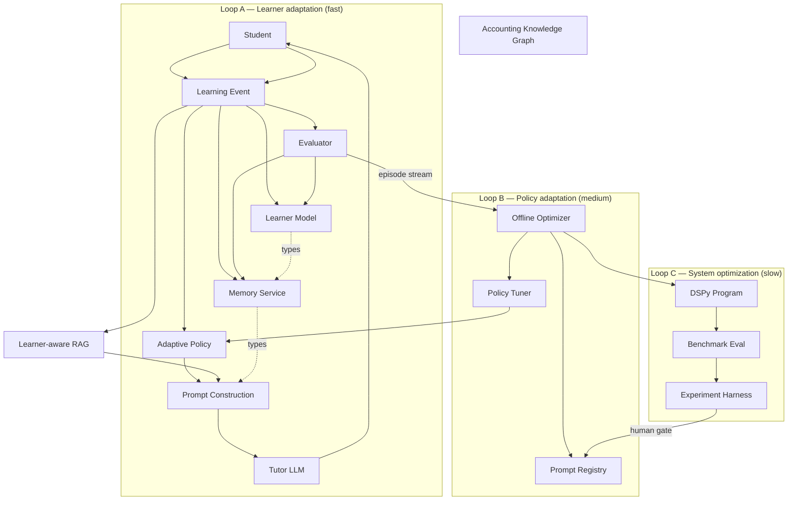

# Target Architecture

> **Status**: `planned` · **Owner**: `architect` · **Last reviewed**: `2026-09-30`
>
> Where Cervana is going: a personalized, self-improving educational agent with explicit component boundaries.

---

## 1. Purpose

This document describes the target architecture Cervana is evolving toward. It is the destination, not the current state. For the current state see [`docs/01-audit/system-audit.md`](../01-audit/system-audit.md) and [`docs/01-audit/agent-architecture-current.md`](../01-audit/agent-architecture-current.md).

The single most important sentence:

> The LLM generates the response. The Learner Model represents the student. Memory represents experience. RAG represents external knowledge. Adaptive Policy decides how to teach. DSPy optimizes the tutoring program. Evaluation determines whether the system actually improved.

Never allow these responsibilities to collapse into a single LLM prompt.

---

## 2. Conceptual architecture



---

## 3. The three feedback loops

Per master prompt §27 and §41, the system runs three distinct loops at different cadences. **Never mix these.**

| Loop | Cadence | Updates | Cannot update | Owner |
|---|---|---|---|---|
| **A — Learner adaptation** | seconds → session | learner state, session memory, strategy within run | prompt versions, policy parameters, frozen benchmark | Tutor agent (autonomous) |
| **B — Policy adaptation** | days → weeks | strategy parameters, scaffolding thresholds, retrieval weights | DSPy programs, frozen benchmark | Optimizer worker (autonomous), human gate to deploy |
| **C — System optimization** | weeks → months | DSPy program versions, evaluation dataset, model selection | production learner records, security policies | Optimizer + DSPy + human approval |

Loop A reads Loop B's output (active policy version) but cannot modify it. Loop B reads Loop C's output (active prompt version) but cannot modify it. Loop C cannot modify the frozen benchmark.

User interaction never waits on loops B or C. All optimization is async.

---

## 4. Component design

### 4.1 Learner Model

`api` service owns all learner state tables. The full model is in [`learner-state.md`](./learner-state.md). Summary:

```
LearnerState
├── Identity
├── Goals
├── Curriculum
├── TopicMastery (per (learner, topic))
├── StepMastery (per (learner, step))
├── Misconceptions (per (learner, concept_key))
├── Preferences (explanation style, pace, hint tolerance)
├── BehavioralSignals (hints, response time, skip rate)
├── RecentLearningState (last 7 days)
├── HistoricalLearningState
├── Confidence
├── DifficultyProfile (current_difficulty, ZPD)
└── AdaptationHistory
```

Mastery update uses an **Elo-like formula** documented in [`learner-state.md` §3](./learner-state.md#3-mastery-formula).

### 4.2 Adaptive Policy

`api` service. Deterministic function — **not LLM**. Input: learner state + memory + current task + course context. Output: `AdaptiveTutoringStrategy` JSON.

```python
AdaptiveTutoringStrategy = {
    "strategy": Literal["guided_practice", "socratic", "worked_example",
                        "review", "spaced_repetition", "diagnostic"],
    "difficulty": float,             # 0..1
    "explanation_style": Literal["visual", "text", "worked_example", "socratic"],
    "hint_level": int,               # 0..3
    "feedback_style": Literal["corrective", "diagnostic", "encouraging"],
    "scaffolding": Literal["high", "medium", "low"],
    "socratic_level": float,         # 0..1
    "response_length": Literal["short", "medium", "long"],
    "retrieval_strategy": Literal["global", "learner_filtered", "topic_filtered"],
    "assessment_mode": Literal["formative", "summative", "none"],
}
```

Full implementation in [`target-state.md` §4.4](#44-adaptive-policy).

### 4.3 Memory architecture

Four typed layers, each with explicit schema:

```
WorkingMemory          (in-request, ephemeral)
EpisodicMemory         (Postgres + optional Qdrant embedding)
SemanticLearnerMemory  (Postgres)
ProceduralMemory       (Postgres)
ExternalKnowledge      (existing Qdrant cervana-embedding + Postgres resources)
```

Quality requirements per item:

```
memory_id, learner_id, type, content, source, created_at, updated_at,
confidence, importance, evidence_count, last_used_at, expires_at, status
```

Status: `ACTIVE | DECAYING | SUPERSEDED | INVALIDATED | ARCHIVED`.

Write policy (master prompt §12) and retrieval scoring (master prompt §13) are documented in [`target-state.md` §4.3](#43-memory-architecture).

### 4.4 Adaptive Policy (full)

#### Decision flow

```
Learner State
      ↓
Current Objective
      ↓
Knowledge Gap
      ↓
Recent Performance
      ↓
Memory
      ↓
Policy (deterministic)
      ↓
Tutoring Strategy
      ↓
Prompt Construction
      ↓
LLM
```

#### Pseudocode

```python
def select_strategy(input: AdaptivePolicyInput) -> AdaptiveTutoringStrategy:
    m = input.learner_state
    mastery = m.topic_mastery.get(input.current_task.topic_id, 0.0)
    zpd_low, zpd_high = m.difficulty_profile.zone_of_proximal_development
    open_misconceptions = sum(1 for mc in m.misconceptions if mc.status == "open")
    recent_failure_rate = m.behavioral_signals.recent_correct_rate
    hint_tolerance = m.preferences.hint_tolerance
    style = m.preferences.explanation_style

    if mastery < 0.3:
        difficulty = max(zpd_low, min(0.4, mastery + 0.2))
    elif mastery < 0.7:
        difficulty = (mastery + zpd_high) / 2
    else:
        difficulty = min(1.0, mastery + 0.15)

    scaffolding = "high" if open_misconceptions >= 2 else (
        "medium" if open_misconceptions == 1 else "low"
    )
    base_hint = {"low": 3, "medium": 2, "high": 1}[hint_tolerance]
    hint_level = max(0, min(3, base_hint - int(mastery * 3)))
    socratic_level = 0.7 if 0.3 <= mastery <= 0.7 else 0.3

    strategy_name = (
        "diagnostic" if open_misconceptions >= 3 else
        "review" if recent_failure_rate < 0.4 else
        "spaced_repetition" if mastery > 0.8 else
        "guided_practice" if mastery < 0.3 else
        "socratic"
    )

    return AdaptiveTutoringStrategy(
        strategy=strategy_name,
        difficulty=difficulty,
        explanation_style=style,
        hint_level=hint_level,
        feedback_style="diagnostic" if open_misconceptions else "encouraging",
        scaffolding=scaffolding,
        socratic_level=socratic_level,
        response_length="medium" if mastery < 0.5 else "short",
        retrieval_strategy="learner_filtered" if mastery < 0.5 else "topic_filtered",
        assessment_mode="formative" if mastery < 0.8 else "summative",
    )
```

### 4.5 Prompt architecture

No single giant prompt. Stack:

```
SYSTEM_POLICY              (immutable)
EDUCATIONAL_POLICY          (immutable)
COURSE_CONTEXT
LEARNER_STATE              (compact)
RELEVANT_MEMORY            (top 5)
CURRENT_TASK
ADAPTIVE_STRATEGY          (from policy)
OUTPUT_CONTRACT
```

Each layer comes from a different source. Each can be A/B tested independently.

### 4.6 DSPy program

`ai-api` service. One signature, one module:

```python
import dspy

class TutorSignature(dspy.Signature):
    """Generate a tutoring response for an individual learner."""
    system_policy: str = dspy.InputField()
    educational_policy: str = dspy.InputField()
    course_context: str = dspy.InputField()
    learner_state: str = dspy.InputField()
    relevant_memory: str = dspy.InputField()
    current_task: str = dspy.InputField()
    adaptive_strategy: str = dspy.InputField()

    reasoning: str = dspy.OutputField()
    response: str = dspy.OutputField()

class AdaptiveTutor(dspy.Module):
    def __init__(self):
        self.tutor = dspy.ChainOfThought(TutorSignature)
    def forward(self, *, system_policy, educational_policy, course_context,
                learner_state, relevant_memory, current_task, adaptive_strategy):
        return self.tutor(
            system_policy=system_policy,
            educational_policy=educational_policy,
            course_context=course_context,
            learner_state=learner_state,
            relevant_memory=relevant_memory,
            current_task=current_task,
            adaptive_strategy=adaptive_strategy,
        )
```

Optimizer choice and benchmark methodology: [`docs/03-plans/dspy-integration.md`](../03-plans/dspy-integration.md).

### 4.7 Evaluation framework

Three channels:

| Channel | Cadence | Inputs | Output |
|---|---|---|---|
| Offline | nightly + on-PR | Frozen eval set (immutable) | `evaluation_runs` rows with per-metric scores |
| Online | per-interaction | Real episodes | `interaction_evaluations` rows |
| Experimental | per-experiment | Stratified samples | `experiment_runs` rows |

Acceptance gate (master prompt §22):

```
candidate is ACCEPTED iff:
    correctness         >= baseline AND
    grounding           >= baseline AND
    pedagogy            >= baseline AND
    personalization      >= baseline AND
    hallucination_rate  <= baseline × 1.05 AND
    p95_latency         <= baseline × 1.10 AND
    cost_per_1k         <= baseline × 1.20
```

Component metrics always exposed separately.

### 4.8 Self-improvement loop

```
interaction
    ↓
episode persisted (Postgres, write to api)
    ↓
evaluator writes evaluation score
    ↓
learner_state updated
    ↓
memory updated (extraction policy)
        ↓ (async, daily)
optimizer worker
    ↓
candidate prompts generated (DSPy / GEPA / MIPRO)
    ↓
run on frozen eval set
    ↓
compare to baseline
    ↓ (gate)
human approval queue
    ↓ on approve
version bump in prompt_registry
canary deploy (5% traffic)
monitor online metrics (1h, 6h, 24h)
    ↓ on green
promote to 100%
```

Rollback: instant revert to previous prompt version. No data loss.

### 4.9 Observability and decision trace

Every tutor response carries a `trace_id`. The trace is persisted in `decision_traces`:

```
trace_id           UUID
learner_id        UUID
session_id        UUID?
task_id           UUID?
agent_version     str
prompt_version    str
policy_version    str
model_name        str
strategy_json     JSONB
retrieved_memory  JSONB
retrieved_chunks  JSONB
response_text     TEXT
evaluation_json   JSONB?
latency_ms        int?
input_tokens      int?
output_tokens     int?
cost_usd          NUMERIC(10,6)?
created_at        timestamp
```

Replayable. Every decision is traceable to its inputs.

---

## 5. Service boundaries

Per the `AGENTS.md` §Service Ownership rule (already in the governing policy):

| Component | Service | Allowed access |
|---|---|---|
| All new Postgres tables (LearnerModel, Memory, Episodes, OptimizationRun, EvaluationDataset) | `api` | Postgres + Prisma only |
| Memory embeddings (Qdrant `cervana-memory`) | `ai-api` | Qdrant only |
| RAG embeddings (Qdrant `cervana-embedding`) | `ai-api` | Qdrant only |
| LLM calls | `ai-api` | LLM provider only |
| Episode log | `api` (Postgres `episodes`) | Postgres + Prisma |
| Eval set (frozen) | `api` (Postgres `evaluation_datasets`, read-only for optimizer) | Postgres read-only from `ai-api` via dedicated endpoint |
| Optimizer worker | `ai-api` Celery | Reads `episodes` and `evaluation_datasets` via HTTP; runs DSPy locally; writes candidate via HTTP |

**ai-api never touches Postgres. api never calls an LLM provider directly.**

Full rationale and detection patterns: [`docs/03-plans/service-boundaries.md`](../03-plans/service-boundaries.md).

---

## 6. Data ownership and routing

| Concern | Owner | Consumer |
|---|---|---|
| User identity, learner state | `api` | every service |
| Curriculum hierarchy | `api` | `ai-api` (read via HTTP) |
| Quiz / Question / Attempt / Answer | `api` | `ai-api` (read), `web` (write attempt) |
| Chat / Message / Content | `api` | `ai-api` (write Content after generation) |
| Resource / file URL | `api` | `ai-api` (read for extraction) |
| Embedding collection `cervana-embedding` | `ai-api` (Qdrant) | `ai-api` only |
| Memory collection `cervana-memory` | `ai-api` (Qdrant) | `ai-api` only |
| Optimizer artifacts (candidate prompts) | `ai-api` (write via HTTP to `api`) | `api` (persists via `prompt_versions`) |

`api` never reads Qdrant. `ai-api` never reads Postgres.

---

## 7. Trade-offs

| Choice | Alternative considered | Why this |
|---|---|---|
| Elo-like mastery | BKT, IRT, logistic mastery | Elo-like survives few-observation regimes, no prior training, deterministic, reproducible. BK needs ~30 attempts per skill. |
| 4 memory tables in Postgres + Qdrant optional embedding | Pure Qdrant for all memory | Postgres gives transactional consistency for typed memory; Qdrant used only for similarity search. |
| DSPy as optimization framework | Manual prompt iteration, LangSmith | DSPy gives typed signatures, optimizer library (BootstrapFewShot / MIPRO / GEPA), and version-able artifacts. |
| Three independent feedback loops | One unified online learning loop | Loops have different cadences and scopes; mixing corrupts them. |
| Service boundaries enforced via HTTP, not shared DB | Shared schema between `api` and `ai-api` | Enforces AGENTS.md service ownership; prevents hidden coupling. |

---

## 8. Migration notes

1. **Existing tables are reused**: do not duplicate `User`, `Topic`, `Quiz`, etc.
2. **Existing pipelines are wrapped**: LangGraph #1 and #2 become the prompt-construction layer of the new tutor endpoint, not replaced wholesale.
3. **Data is migrated forward**: existing `QuizAttempt.score` (always null) becomes a hook for the new `MasteryService`. Existing `LessonProgress.introduction` (LLM-generated text) stays as-is.
4. **Cross-lesson memory leak**: existing Qdrant data is left in place but marked `SUPERSEDED`; new writes go through the typed schema.
5. **Boundary migration**: the violation in `cervana-api/src/common/lib/embeding.ts` (direct Gemini call) is replaced by an HTTP call to a new `ai-api` endpoint, per `AGENTS.md` §Service Ownership.

---

## 9. Open questions

See [`docs/progress-tracker.md`](../progress-tracker.md) §Open questions for the eight decisions pending owner input.

The most consequential:

- Q-01: Mastery formula — Elo-like (recommended) vs BKT vs IRT.
- Q-03: Service boundaries — confirm `api` owns all new DB tables.
- Q-08: Qdrant embedding dimension — keep 768 vs migrate to 1536.

These must be resolved before Phase 2 (Domain Model) starts.