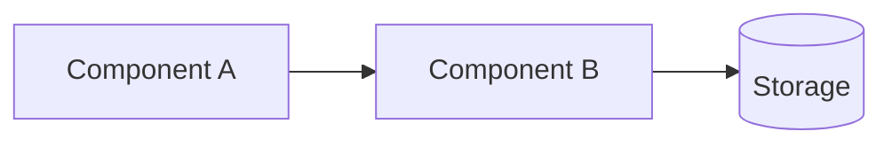

# Documentation Style Guide

> **Read this before writing any document in `docs/`.**
> Every file under `docs/` must conform to this guide. Deviation requires an explicit ADR.

This guide exists so that an engineer, a researcher, or an AI coding agent can read **any single document** in `docs/` and understand the project without guessing. Consistency is not aesthetics — it is a precondition for verifiable, AI-readable documentation.

---

## 1. Document frontmatter

Every document begins with this exact structure:

```markdown
# <Title>

> **Status**: `<planned | in-progress | stable | superseded>` · **Owner**: `<role or name>` · **Last reviewed**: `YYYY-MM-DD`
>
> One-sentence purpose statement.

<optional: short orientation paragraph>

---

## <Section 1>

...
```

### Field semantics

| Field | Allowed values | Notes |
|---|---|---|
| `Status` | `planned`, `in-progress`, `stable`, `superseded` | `planned` = design only, no code. `in-progress` = code partially exists. `stable` = matched to current code. `superseded` = replaced by another doc, keep for archaeology. |
| `Owner` | role string (e.g., `architect`, `ml-lead`, `ops`) | Single owner per doc. |
| `Last reviewed` | `YYYY-MM-DD` | Updated whenever the doc is materially changed. |

### Example

```markdown
# Self-Improving LLM — 12-Week Plan

> **Status**: `planned` · **Owner**: `ml-lead` · **Last reviewed**: `2026-09-30`
>
> Controlled, auditable, reversible improvement of the tutor prompt and policy.

---

## 1. Objective
...
```

---

## 2. Standardized labels

These labels are used identically across all docs. Never invent synonyms.

### 2.1 Capability status

| Label | Meaning | When to use |
|---|---|---|
| `implemented` | Code exists, runs, and is wired end-to-end. | `services/api/src/v1/auth/jwt.guard.ts` is `implemented`. |
| `partial` | Some pieces work; the rest are missing or broken. | RAG retrieval is `partial` (works in 2 flows, broken in 1). |
| `scaffolded` | Structure exists (table, endpoint, model) but no real behavior. | `Achievement` model is `scaffolded` — no evaluator awards it. |
| `referenced` | Name appears in docs, env, or schema; no behavior. | `notes.md` claims a daily-stats cron that is `referenced` but `not implemented`. |
| `planned` | Design exists, no code yet. | DSPy integration is `planned`. |

### 2.2 Priority

| Label | Meaning |
|---|---|
| `P0` | Must fix before any production deployment. |
| `P1` | Required for self-improvement. |
| `P2` | Research-grade (defer until P0/P1 done). |
| `P3` | Nice-to-have. |

### 2.3 Task status (in tables)

| Marker | Meaning |
|---|---|
| `[ ]` | Not started |
| `[~]` | In progress |
| `[x]` | Complete |
| `[!]` | Blocked — explain in adjacent column |

---

## 3. Required sections per document type

### 3.1 Audit document (`docs/01-audit/*.md`)

Must contain:

1. `## Scope` — what is audited.
2. `## Findings` — table or list with status, evidence, impact.
3. `## Evidence citations` — file paths with line ranges used.
4. `## Verdict` — single-paragraph summary status.

### 3.2 Architecture document (`docs/02-architecture/*.md`)

Must contain:

1. `## Purpose` — what this artifact describes.
2. `## Conceptual model` — diagram (Mermaid preferred).
3. `## Schema` — code blocks with full type definitions.
4. `## Algorithms` — formulas in fenced math or code blocks, with edge-case behavior.
5. `## Trade-offs` — explicit list of alternatives considered and why this choice.
6. `## Migration notes` — what changes if implementing this on top of the current system.

### 3.3 Plan document (`docs/03-plans/*.md`)

Must contain:

1. `## Objective` — what this plan achieves.
2. `## Scope` — what files / components are touched.
3. `## Design` — the proposed approach.
4. `## Step-by-step` — ordered implementation tasks.
5. `## Acceptance criteria` — measurable conditions for "done".
6. `## Risks` — list with severity and mitigation.
7. `## Rollback` — how to revert if needed.

### 3.4 Operations document (`docs/04-operations/*.md`)

Must contain:

1. `## Purpose` — what this runbook/checklist is for.
2. `## When to use` — trigger condition.
3. `## Procedure` — ordered steps.
4. `## Verification` — how to confirm success.
5. `## Escalation` — when and how to escalate.

---

## 4. Evidence citation

Every claim that is not obvious must cite an evidence path.

### 4.1 Format

```
Evidence: `path/to/file.ts:NN-MM`
```

Where `NN-MM` is the inclusive line range.

### 4.2 Acceptable evidence sources

1. **Repository files**: `services/api/src/v1/chat/contents/contents.repo.ts:80-86`.
2. **External docs**: link to URL + retrieval date.
3. **Database objects**: `prisma/schema.prisma:312-326` or `prisma/migrations/20251202032210_final_db/migration.sql`.
4. **Configuration**: `.env.example:69` or `docker-compose.yml:48-65`.
5. **Cross-doc reference**: `[data-model.md](./02-architecture/data-model.md#learner-state)`.

### 4.3 When to quote vs paraphrase

- **Quote** when the exact wording matters (error messages, prompt fragments, contract strings).
- **Paraphrase** when explaining behavior; back the paraphrase with a file:line citation.

### 4.4 Anti-pattern: evidence-free claims

Never write:

```markdown
The agent uses dynamic planning.
```

Without:

```markdown
The agent uses dynamic planning.
Evidence: `grep add_conditional_edges services/ai-api/` → 0 results.
```

---

## 5. Tables

### 5.1 When to use

- 3+ rows of items with the same shape.
- Comparisons (status, priority, capability).
- Inventories.

### 5.2 Column conventions

First column = the noun being described.
Last column = action or status (or notes).
Middle columns = attributes.
Left-align text columns.
Numeric columns right-align (use `--` separator if needed; in this repo we keep markdown default).

### 5.3 Status columns

If a column is "status", use only the standardized labels from §2.1 or §2.3.

---

## 6. Diagrams

### 6.1 Mermaid for component relationships

Use Mermaid when:

- The diagram has 3+ nodes with edges.
- The diagram is rendered in GitHub / GitLab / VS Code.
- The diagram will be edited as text.

Always include a Mermaid block:

````markdown

````

### 6.2 ASCII for inline / terminal-friendly rendering

Use ASCII when:

- The document is read in a terminal.
- The diagram must be editable in plain text editors without language support.
- The diagram is small (≤ 30 boxes).

Format:

```
┌─────────┐      ┌─────────┐
│ Frontend│ ───► │  API    │
└─────────┘      └─────────┘
```

### 6.3 When NOT to use a diagram

- A table of 3 rows conveys the same information.
- The relationship is "A is in B" — say it in prose.

---

## 7. Code blocks

### 7.1 Languages

Always specify the language in the fence:

````markdown
```prisma
model User { id String @id }
```
````

````markdown
```python
def mastery_update(prior: float, observed: float) -> float:
    return ...
```
````

````markdown
```typescript
@Injectable()
export class AdaptivePolicyService {}
```
````

### 7.2 When to wrap in code block

- Schemas (Prisma, TypeScript types, Pydantic models).
- Configs (yaml, toml, json).
- Formulas (use `python` or `text`; no MathJax).
- Sample code that the reader should read literally.

### 7.3 When NOT to wrap in code block

- Pseudocode that is just illustrative.
- Bash one-liners (use ` ```bash ` if multi-line).

---

## 8. Cross-references

### 8.1 Relative paths

Always use relative paths within `docs/`:

```markdown
See [`data-model.md`](./02-architecture/data-model.md).
```

For external files:

```markdown
Schema: `services/api/prisma/schema.prisma:312-326`.
```

### 8.2 Anchor links

For long docs, use GitHub-style anchors:

```markdown
See [Mastery Formula §3](./02-architecture/learner-state.md#3-mastery-formula).
```

### 8.3 Forward references

If a document depends on another that does not yet exist, write:

```markdown
See the planned [Self-Improvement Loop](./03-plans/self-improving-llm.md#layer-5-online-ab-with-rollback).
```

---

## 9. Voice and tone

### 9.1 Allowed

- Direct, factual, evidence-cited.
- Tables and code blocks preferred over prose for structured info.
- Hedging only when evidence is genuinely uncertain (then say so explicitly).
- Tables for status; prose for reasoning.

### 9.2 Forbidden

- **Marketing language**: "powerful", "intelligent", "robust", "seamless" — without a measurable definition.
- **Vague hedging**: "may", "could", "potentially" — without evidence.
- **Future tense in audit docs**: an audit describes what *is*. Use present tense. Plans describe what *will be*.
- **Unjustified claims**: any sentence that asserts capability without an evidence path.
- **Sycophantic openers**: "It is important to note that...", "In conclusion...".
- **Redundant section intros**: every section does not need "In this section we will discuss..."

### 9.3 Specific phrases to avoid

| Forbidden | Replacement |
|---|---|
| "The system intelligently understands..." | "The LLM call returns X given prompt Y." |
| "Robust error handling" | "On exception, the service returns 503 and logs `trace_id`." |
| "Easy to extend" | "Adding a new strategy requires: 1) implement `select_strategy()` 2) register in `STRATEGY_REGISTRY`." |
| "Best practices" | Specific rules with evidence. |
| "Industry standard" | Cite the standard. |

---

## 10. Stable IDs

For documents that reference test cases, decisions, or events, use a stable ID prefix:

| Prefix | Meaning | Example |
|---|---|---|
| `C-` | Critical finding | `C-001` — missing similarity endpoint |
| `H-` | High finding | `H-008` — no OTel |
| `M-` | Medium finding | `M-016` — unused deps |
| `L-` | Low finding | `L-033` — no multi-tenant |
| `PL-` | Plan-level task | `PL-01` — switch to OpenAI |
| `IMPL-` | Implementation task | `IMPL-01` — Phase 0 stabilization |
| `Q-` | Open question | `Q-01` — mastery formula choice |
| `ADR-` | Architecture Decision Record | `ADR-001` — service ownership |

**Never re-use an ID.** If a task is replaced, mark the original `SUPERSEDED:` in the new task.

---

## 11. Diagrams in code: ASCII conventions

```
┌─ box top
│  box body
└─ box bottom
```

- Use `┌`, `┐`, `└`, `┘`, `─`, `│` for borders.
- Use `─►` for forward arrows; `◄──` for back arrows.
- Use `▼` for downward arrows.
- Use `┌──┐` for 2-wide boxes, `┌────┐` for 4-wide.
- Use `═══════` for horizontal dividers (7+ `═`).
- Use `│ ✓ implemented ⚠ partial ✗ missing ─► flow` as a legend block.

---

## 12. Length budgets

| Doc type | Target | Maximum |
|---|---|---|
| README / index | 100 lines | 200 |
| Audit doc | 200 lines | 500 |
| Architecture doc | 300 lines | 800 |
| Plan doc | 250 lines | 600 |
| Operations doc | 150 lines | 400 |

If a doc exceeds the maximum, split it. **Long is not thorough; clear is thorough.**

---

## 13. Anti-patterns checklist

Before marking a doc complete, verify:

- [ ] Frontmatter present with `Status`, `Owner`, `Last reviewed`.
- [ ] All required sections per type (§3) are present.
- [ ] Every non-obvious claim cites an evidence path (§4).
- [ ] Status labels use only the standardized values (§2).
- [ ] Priority labels use only `P0`–`P3` (§2.2).
- [ ] Tables use first-column noun convention (§5).
- [ ] Diagrams are Mermaid or ASCII, not mixed random styles (§6).
- [ ] Code blocks declare language (§7.1).
- [ ] Cross-references are relative paths or stable file:line citations (§8).
- [ ] No marketing language, no vague hedging, no future tense in audit docs (§9).
- [ ] Stable IDs follow the prefix convention (§10).
- [ ] Length is within budget (§12).

---

## 14. Change discipline

When editing a doc:

1. Update `Last reviewed` date.
2. If a `Status` field changes, update the `progress-tracker.md`.
3. If a section is removed, replace it with `[REMOVED]` and a link to the new location. Do not silently delete content.
4. If two docs disagree, the audit doc wins for what *is*; the plan doc wins for what *will be*. Resolve in the next planning pass.

---

## 15. Reviewer checklist

A reviewer must reject a PR that:

- Introduces a new doc without frontmatter.
- Uses non-standardized status labels.
- Asserts a capability without an evidence path.
- Contains `// ` comments in code blocks (use of comments in docs is fine; in code is per `AGENTS.md`).
- Re-uses a stable ID.
- Mixes Mermaid and ASCII for the same diagram.
- Describes implementation in an audit doc, or describes the current state in a plan doc.

---

## 16. When this guide itself changes

This guide is the meta-document. Changes to this guide:

1. Must be proposed in an ADR.
2. Must be reviewed by at least two other docs in `docs/`.
3. Must update `progress-tracker.md` if any doc needs to be retro-fitted.

The current version is `v1.0` (2026-09-30).