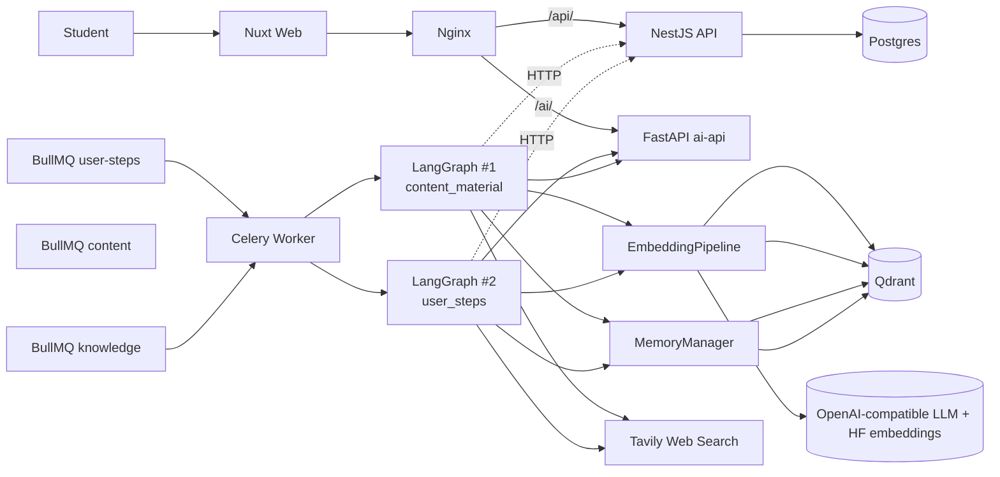
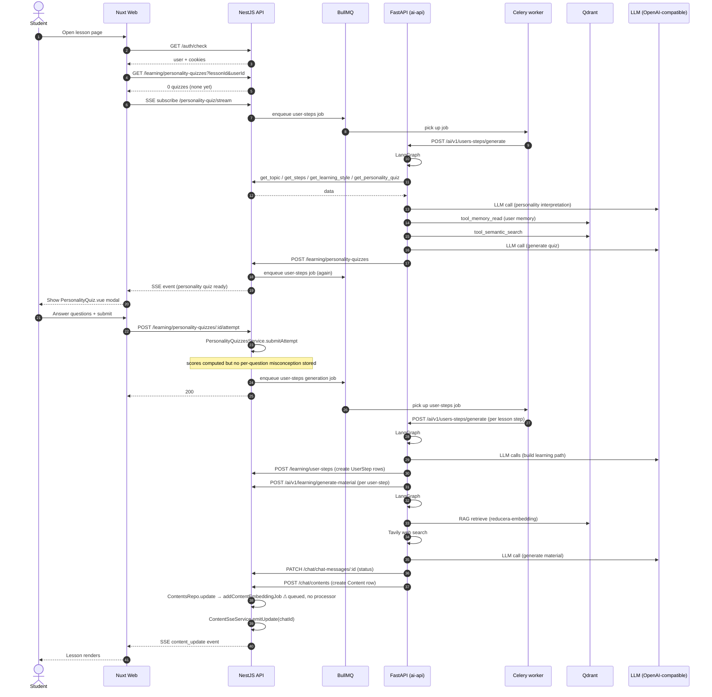

# Agent Architecture — Current State

> **Status**: `stable` · **Owner**: `architect` · **Last reviewed**: `2026-09-30`
>
> The actual agentic surface of ReduCera as it exists today — not as the README or notes claim.

---

## 1. Scope

This document describes what is actually implemented in `services/ai-api/` and the agentic responsibilities it claims. It is intentionally short. For the gap analysis and target architecture, see [`docs/02-architecture/target-state.md`](../02-architecture/target-state.md).

---

## 2. The "agents" identified

| Name | Type | Evidence | Genuine agent? |
|---|---|---|---|
| `GenerateContentMaterialPipeline` | LangGraph: `parallel_fetch` → `prepare_learning_context` → `generate_material` | [`v1/learning/content_pipeline.py:236-244`](../../services/ai-api/v1/learning/content_pipeline.py) | ❌ linear pipeline, no tool use, no reflection |
| `GenerateUserStepPipeline` | LangGraph: `fetch` → `personality_material_builder` → `build_context` → `read_memory` → `semantic_search` → `external_search` → `generate` | [`v1/users_steps/generate_user_steps_pipeline.py:372-395`](../../services/ai-api/v1/users_steps/generate_user_steps_pipeline.py) | ❌ linear pipeline, no reflection |
| `generating_new_content` (chat continuation) | Single LLM call wrapped in Celery task | [`v1/learning/workers.py:42-97`](../../services/ai-api/v1/learning/workers.py) | ❌ single-prompt LLM wrapper |
| `generate_personality_quiz` | LangGraph: `pararel_fetch` → `process_results` → `analyze_text` | [`v1/users_steps/generate_quiz_pipeline.py:157-165`](../../services/ai-api/v1/users_steps/generate_quiz_pipeline.py) | ❌ linear pipeline |
| `Chatbot.vue` (frontend) | SSE listener + LLM response renderer | [`apps/web/app/components/my-learning/Chatbot.vue:29-43`](../../apps/web/app/components/my-learning/Chatbot.vue) | ❌ UI only |

**Verdict**: zero real agents. Two linear LangGraph wrappers + three direct LLM calls.

---

## 3. Agent-loop classification

Today's system follows **Pattern B**: `INPUT → PROMPT → LLM → OUTPUT`.

It does **not** follow **Pattern A**: `OBSERVE → REASON → PLAN → ACT → OBSERVE`.

| Property of a real agent | Present? | Evidence |
|---|---|---|
| Tool-calling loop | ❌ | `grep -rn bind_tools function_call tool_choice ToolNode services/ai-api/ → 0` |
| Dynamic planning (conditional edges) | ❌ | `grep -rn add_conditional_edges services/ai-api/ → 0` |
| Reflection / self-critique | ❌ | No node evaluates output of another node |
| Verification step (post-LLM assertion) | 🟡 | `generate_quiz_pipeline.py:152-154` catches JSON parse errors, returns empty `QuizResponse`; nothing else |
| Stop / ask-human | ❌ | – |
| State across turns | ❌ | State dies with Celery task |

---

## 4. Architecture — current



---

## 5. ASCII visualization

```
┌─────────────────────────────────────────────────────────────────────────────┐
│  MACRO VIEW  -  ALL "AGENTS" AND THEIR BOUNDARIES                            │
└─────────────────────────────────────────────────────────────────────────────┘

  [Student/Teacher]
       │
       ▼
  ┌──────────────┐         ┌─────────────────────────────────────────────────┐
  │  Nuxt Web    │ ──────► │  Nginx  :80                                     │
  │  app/pages/**│         │     │            │            │                │
  └──────────────┘         │     │/      │/api/      │/ai/             │
                          │     ▼       ▼             ▼                │
                          │  [Nuxt]  [NestJS]       [FastAPI]        │
                          │   :3000   :3002           :3003          │
                          └────│───────│───────────────│──────────────┘
                               │       │                │
                               │       ▼                │
                               │  ┌─────────────────────────────────────┐│
                               │  │ NestJS Core API  (orchestrator)    ││
                               │  │                                   ││
                               │  │ [JwtAuthGuard] [RolesGuard]        ││
                               │  │ [Arcjet rate-limit] [SSE bus]      ││
                               │  │                                   ││
                               │  │ BullMQ queues:                    ││
                               │  │    [knowledge] → has processor     ││
                               │  │    [content]    → ⚠ NO PROCESSOR   ││
                               │  │    [user-steps] → has processor     ││
                               │  └────┬─────────────────┬─────────────┘│
                               │       │                 │              │
                               │       │ enqueue         │ enqueue      │
                               │       ▼                 ▼              │
                               │  ┌────────────────────────────────────────┐│
                               │  │ FastAPI Tutor API  (agentic layer)  ││
                               │  │                                        ││
                               │  │ [EmbeddingPipeline] Qdrant + HF/LLM ││
                               │  │ [MemoryManager]      Qdrant memory   ││
                               │  │ [tool_web_search]    Tavily           ││
                               │  │                                        ││
                               │  │ LangGraph #1: generate_content        ││
                               │  │    parallel_fetch → context → gen    ││
                               │  │                                        ││
                               │  │ LangGraph #2: generate_user_steps     ││
                               │  │    fetch → personality → build_ctx    ││
                               │  │    → read_mem → sem_search → ext_srch││
                               │  │    → generate                         ││
                               │  │                                        ││
                               │  │ Direct LLM: generating_new_content   ││
                               │  │    (chat continuation)               ││
                               │  │                                        ││
                               │  │ Celery workers:                       ││
                               │  │    [extract_task]   PDF + YT          ││
                               │  │    [embedding_task]  resource embed   ││
                               │  │    [generate_content_material_task]   ││
                               │  │    [generating_new_content_task]      ││
                               │  │    [generate_personality_quiz_task]   ││
                               │  └────┬─────────────────┬─────────────┘│
                               │       │                 │              │
                               └───────│─────────────────│──────────────┘
                                       ▼                 ▼
                              ┌──────────┐         ┌──────────┐
                              │ Postgres │         │  Qdrant  │
                              └──────────┘         └──────────┘
                                          │
                                          ▼
                                    ┌──────────┐
                                    │  Redis   │
                                    └──────────┘


┌─────────────────────────────────────────────────────────────────────────────┐
│  THE TWO LANGGRAPH "AGENTS"                                                  │
└─────────────────────────────────────────────────────────────────────────────┘

  AGENT 1 - Content-Material Generator     AGENT 2 - User-Steps Planner
  v1/learning/content_pipeline.py           v1/users_steps/generate_user_steps_pipeline.py

  ┌─────┐ parallel_fetch                    ┌─────┐ fetch
  │START│ ──────────────►  get_lesson         │START│ ───────►  topic + learningStyle
  └──┬──┘  get_step                          └──┬──┘  steps + personality quiz
     │      get_user_step                          │      target step
     │      get_learning_style                       │
     │                                                │
     ▼                                                ▼
  ┌─────────┐ prepare_learning_context          ┌────────────────┐  personality_material_builder
  │analysis │ ─────────►  LLM call #1             │ interpret quiz │ ─────►  LLM call
  │ prompt  │             (summarize context)     └───────┬────────┘
  └────┬────┘                                            │
       │                                                  ▼
       ▼                                          ┌──────────────┐  build_context
  ┌─────────┐  generate_material                 │ assemble ctx │ ──────►  text aggregation
  │RAG + web│ ─────────►  RAG retrieve             └───────┬───────┘
  │ + LLM #2│             Tavily search                    │
  │material│             LLM generate                       ▼
  └────┬────┘                                       ┌──────────────┐  read_memory
       │                                           │ tool_memory_ │ ─────►  Qdrant
       ▼                                           │    read      │         reducera-memory
  ┌─────────┐  POST /chat/contents                │              │         ⚠ fallback bug
  │  END   │ ─────────►  write Content + SSE      └───────┬───────┘         (cross-lesson leak)
  └─────────┘                                           │
                                                         ▼
                                                ┌──────────────┐  semantic_search
                                                │ MemoryManager│ ─────►  Qdrant
                                                │ tool_semantic│ filter by lessonId
                                                └───────┬───────┘
                                                         │
                                                         ▼
                                                ┌──────────────┐  external_search
                                                │ Tavily       │ ─────►  web search
                                                └───────┬───────┘
                                                         │
                                                         ▼
                                                ┌──────────────┐  generate
                                                │ LLM call     │ ─────►  learning path JSON
                                                └───────┬───────┘
                                                         │
                                                         ▼
                                                ┌──────────────┐  POST /learning/personality-quizzes
                                                │ END          │ ─────────►  save result + create user-steps
                                                └──────────────┘


┌─────────────────────────────────────────────────────────────────────────────┐
│  STATE / MEMORY BOUNDARIES                                                  │
└─────────────────────────────────────────────────────────────────────────────┘

  ┌─────────────── Inside a Celery task ────────────────┐
  │                                                    │
  │   Pydantic state object (in-memory only)            │
  │   GenerateContentMaterialPipeline  /  LPState      │
  │   Local variables                                  │
  │   No persistence between tasks │
  │                                                    │
  └─────────┬──────────────────────┬──────────────────┘
            │ writes                  │ writes
            ▼                         ▼
  ┌──────────────────┐       ┌──────────────────┐
  │ Qdrant           │       │ Postgres         │
  │ reducera-memory   │       │ chat_messages    │
  │ (MemoryManager)  │       │ contents         │
  │                  │       │ user_steps       │
  └──────────────────┘       └──────────────────┘


  ┌─────────────── Does NOT exist ──────────────────────┐
  │                                                    │
  │   ✗ Episode / run_id log                           │
  │   ✗ Evaluation traces                              │
  │   ✗ Mastery table │
  │   ✗ Misconception table │
  │   ✗ Prerequisite graph                             │
  │   ✗ RecommendationService                          │
  │   ✗ Self-improvement loop                          │
  │   ✗ Metrics / traces / tests                       │
  │                                                    │
  └────────────────────────────────────────────────────┘


LEGEND
 ✓ implemented   ⚠ broken/partial    ✗ missing    ─► flow
```

---

## 6. Tools registered per "agent"

| Agent | Tool | Read/Write | Effect |
|---|---|---|---|
| Content-Material | `EmbeddingPipeline.retrieve` | R | Vector search over `reducera-embedding` |
| Content-Material | `tool_web_search` | R | Tavily HTTP call |
| Content-Material | `MemoryManager.upsert` | W | Inserts into `reducera-memory` |
| Content-Material | REST GET `/curriculum/lessons/:id`, etc. | R | Per-request fan-out into NestJS |
| Content-Material | `query_content_history` → `/chat/contents/similarity` | R | ❌ Broken — endpoint missing |
| Content-Material | `POST /chat/contents`, `PATCH /chat/chat-messages/:id` | W | Persists AI output |
| User-Steps | `tool_memory_read` | R | Reads from `reducera-memory` |
| User-Steps | `tool_semantic_search` | R | Vector search filtered by `userId+lessonId`; ⚠ fallback leaks across lessons |
| User-Steps | `tool_web_search` | R | Tavily |
| User-Steps | `MemoryManager.upsert` | W | Inserts summary into memory |
| User-Steps | REST GETs (same set as Content-Material) | R | Fan-out |
| User-Steps | `POST /learning/personality-quizzes`, `POST /learning/user-steps` | W | Persists |

---

## 7. End-to-end user journey (today)



---

## 8. What's here vs what's not

```mermaid
flowchart LR
  subgraph HERE["What is here"]
    A[2 deterministic LangGraph pipelines]
    B[1 direct LLM call for chat]
    C[Qdrant-based RAG]
    D[Qdrant-based user memory]
    E[SSE real-time push]
    F[BullMQ async workers]
    G[3 NestJS queues, 1 processor missing]
  end

  subgraph NOT["What is NOT here"]
    H[No agent loop / ReAct]
    I[No tool-calling API]
    J[No reflection / evaluation step]
    K[No mastery tracking]
    L[No misconception model]
    M[No prerequisite graph]
    N[No quiz grader → no signal]
    O[No recommender]
    P[No self-improvement loop]
    Q[No metrics, traces, tests]
  end

  HERE -.feeds.-> NOT
```



The system today is best described as a **content-generation orchestration pipeline**, not an agentic learning system. Every "agent" is a precompiled static LangGraph topology with linear edges. There is no decision-making, no reflection, no tool-calling loop, no autonomy.

The pipeline works for *generating learning material*; it does **not** work for *deciding what a learner should do next*, because that requires a `Mastery` model and a `Misconception` model that do not exist. See [`docs/02-architecture/target-state.md`](../02-architecture/target-state.md) for the gap and the plan.