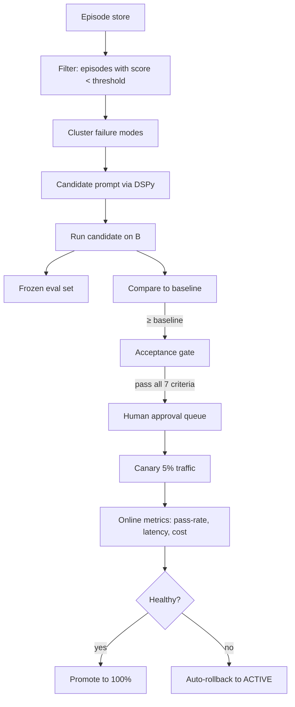

# Self-Improving LLM — 12-Week, 6-Layer Plan

> **Status**: `planned` · **Owner**: `ml-lead` · **Last reviewed**: `2026-09-30`
>
> How to make ReduCera's tutor LLM actually self-improve: observed → measured → evaluated → improved → measured again.

---

## 1. Objective

Build a controlled, auditable, reversible improvement loop for the tutor prompt and policy. The system may **propose** improvements; only humans may **deploy** them.

This plan assumes the broader roadmap in [`docs/03-plans/phased-roadmap.md`](./phased-roadmap.md) is being executed. Specifically, Phases 1–6 (observability, domain model, memory, learner model, adaptive policy, agent integration) must be at least stable before Phase 7 (DSPy) begins.

---

## 2. Scope

Files affected when implemented:

- `api/src/v1/observability/episode-store.service.ts` (new)
- `api/src/v1/observability/decision-trace.service.ts` (new)
- `api/src/v1/optimization/optimizer.service.ts` (new)
- `api/src/v1/optimization/acceptance-gate.service.ts` (new)
- `api/src/v1/optimization/canary.service.ts` (new)
- `api/src/v1/evaluator/benchmark-runner.service.ts` (new)
- `services/ai-api/v1/optimization/dspy_program.py` (new)
- `services/ai-api/v1/optimization/runner.py` (new)
- `services/ai-api/v1/evaluator/grade.py` (new)
- `services/ai-api/pyproject.toml` (add `dspy`)
- `services/api/prisma/schema.prisma` (already includes `Episode`, `DecisionTrace`, `OptimizationRun`, `PromptVersion` per [`docs/02-architecture/data-model.md`](../02-architecture/data-model.md))

---

## 3. Why this is hard

Self-improvement without ground truth is just a feedback loop that drifts toward local minima. Without an immutable benchmark, the optimizer will overfit to its training set. Without a human gate, regressions ship to users. Without replayability, debugging post-hoc is impossible.

The plan below enforces all four: ground truth via evaluation, immutable benchmark via `EvaluationDataset.isFrozen = true`, human gate via `OptimizationRun.decidedBy`, replayability via `Episode` + `DecisionTrace`.

---

## 4. The 6 layers (in order)

### Layer 0 — Observability foundation

**Why first**: without episode storage and trace IDs, every downstream layer operates blind.

**Deliverables**:
- `Episode` table populated by the tutor pipeline for every response.
- `DecisionTrace` table populated with strategy, retrieved memory, retrieved chunks.
- `trace_id` flows end-to-end (Nuxt → Nginx → api → ai-api → LLM).
- Token usage and cost captured per episode.

**Time**: ~1 week.

**Acceptance**:
- Every response produces exactly one `Episode` and one `DecisionTrace`.
- `trace_id` is queryable in OTel-compatible backend.

### Layer 1 — Quiz evaluator + Mastery model

**Why second**: a self-improving system needs a signal that learning is happening. Without mastery tracking, no improvement is measurable.

**Deliverables**:
- `QuizEvaluationService` (deterministic for `MULTIPLE_CHOICE`, rubric-LLM-judge for free-text).
- `MasteryService` updating `TopicMasteryRecord` per [`docs/02-architecture/learner-state.md`](../02-architecture/learner-state.md) §3.
- `MisconceptionDetector` writing to `Misconception` table.

**Time**: ~3 weeks.

**Acceptance**:
- All 8 golden-vector mastery tests pass.
- `QuizAttempt.score` and `Answer.isCorrect` are set for every submission.

### Layer 2 — Evaluation harness

**Why third**: now that we have episodes, we need ground truth to measure them against.

**Deliverables**:
- Frozen benchmark with ≥ 50 representative accounting scenarios in `EvaluationDataset` (`isFrozen = true`).
- LLM-as-judge with rubric for correctness, grounding, pedagogy, personalization.
- Nightly cron running the benchmark against current active prompt + policy versions.
- `evaluation_runs` rows for each nightly run.

**Time**: ~2 weeks.

**Acceptance**:
- Optimizer cannot write to the frozen benchmark (DB constraint).
- Grader agreement with human labels ≥ 0.85 (Cohen's κ).
- Nightly run produces a row.

### Layer 3 — Prompt registry + versioning

**Why fourth**: the optimizer needs to propose candidates. Candidates must be versioned and addressable by name.

**Deliverables**:
- `PromptVersion` table with `status: DRAFT | EXPERIMENTAL | VALIDATED | ACTIVE | REJECTED | ROLLED_BACK | ARCHIVED`.
- Loader: cache in memory; refresh on signal.
- Router: route traffic by `prompt_version` for A/B tests.
- Kill switch: instant revert to last `ACTIVE` version.

**Time**: ~1 week.

**Acceptance**:
- All prompts sourced from registry; no inline prompt strings in code.
- A/B router correctly splits traffic.
- Kill switch rolls back to `ACTIVE` in <1 second.

### Layer 4 — Offline experiment runner

**Why fifth**: before any optimization can run against live traffic, it must prove itself on offline data.

**Deliverables**:
- Worker that:
  1. Picks failing episodes (evaluation_score < threshold) from `Episode` store.
  2. Generates prompt variant via DSPy `BootstrapFewShot` (or `MIPRO`/`GEPA` later).
  3. Runs the variant against the frozen eval set.
  4. Compares component metrics vs baseline.
  5. Writes candidate to `OptimizationRun` with `decision: PENDING`.
- Sandbox: runs in copy of `api` + `ai-api` containers, no write to production `prompt_versions`.

**Time**: ~2 weeks.

**Acceptance**:
- Worker produces an `OptimizationRun` row at least weekly.
- Sandbox is isolated (no network access to production Postgres / Qdrant except via dedicated endpoints).

### Layer 5 — Online canary + auto-rollback

**Why sixth and last**: the offline test is necessary but not sufficient. Real traffic introduces prompt sensitivity that the eval set cannot anticipate.

**Deliverables**:
- Traffic splitter: 95% `ACTIVE`, 5% candidate (ramp to 50% if healthy).
- Real-time dashboards per version: pass-rate, p50/p95 latency, cost per 1k, evaluator disagreement.
- Auto-rollback if any metric regresses > 10% in 1 hour.
- Human approval gate (admin endpoint) before promotion to 100%.
- Optimization canary is **never** deployed without human approval.

**Time**: ~2 weeks.

**Acceptance**:
- Canary auto-rolls back on simulated regression.
- Human approval queue endpoint works.
- Promotion to 100% requires `decidedBy` set to a human ID.

---

## 5. End-to-end self-improvement loop



---

## 6. Acceptance gate (master prompt §22)

A candidate is ACCEPTED only if **all** the following hold:

```
correctness         >= baseline
grounding           >= baseline
pedagogy            >= baseline
personalization      >= baseline
hallucination_rate  <= baseline × 1.05
p95_latency         <= baseline × 1.10
cost_per_1k         <= baseline × 1.20
```

Component metrics are **always** exposed separately. No opaque aggregate.

---

## 7. Failure modes

| Failure | Behavior |
|---|---|
| Frozen benchmark missing | Optimizer refuses to run |
| Optimizer worker crash | Episode stream accumulates; restart from last checkpoint |
| Canary regression > 10% in 1h | Auto-rollback to last `ACTIVE` version |
| Eval set changed mid-experiment | All in-flight optimization runs invalidated; `decision: REJECTED` |
| Human approval queue offline | Canary continues; promotion blocked until queue reachable |

---

## 8. Risk register

| Risk | Severity | Mitigation |
|---|---|---|
| Optimizer mutates production prompt without human gate | Critical | Optimizer runs in sandbox; `PromptVersion.status` cannot transition to `ACTIVE` without human |
| Optimizer overfits to eval set | High | Frozen benchmark separates from training; require ≥ 5% absolute improvement |
| Canary regression ships to 1% of users | Medium | Auto-rollback in 1h on regression; rollback < 1s |
| Token/cost regression hidden by aggregate metric | Medium | Per-component metric exposed in gate |

---

## 9. Trade-offs

| Choice | Alternative | Why this |
|---|---|---|
| DSPy as optimizer | LangSmith, manual | DSPy gives typed signatures + optimizer library + versioned artifacts. |
| Frozen benchmark separates from training | Same dataset for both | Prevents overfitting; standard practice. |
| Human gate on every candidate promotion | Auto-deploy | Required by master prompt §1.4. |
| Async nightly optimizer | Real-time optimizer | Cost + complexity; nightly is sufficient. |

---

## 10. Acceptance criteria for this plan

| ID | Criterion |
|---|---|
| AC-SI-01 | All 6 layers implemented and integrated |
| AC-SI-02 | One full loop completed (failing episodes → candidate → eval → gate → canary → promoted OR rejected) |
| AC-SI-03 | At least one DSPy optimization run improves `overall_score` by ≥ 5% on the optimization set |
| AC-SI-04 | At least one canary auto-rollback event simulated and verified |
| AC-SI-05 | Human approval queue reviewed at least once by the owner |

---

## 11. Open questions

| ID | Question | Decision owner |
|---|---|---|
| Q-04 | Optimization cadence: nightly vs weekly? | ops |
| Q-06 | Optimizer order: BootstrapFewShot → MIPRO → GEPA? | ml-lead |
| Q-11 | Re-evaluation cadence for the frozen benchmark itself: yearly? | research lead |