# Business Processes

> **Status**: `planned` · **Owner**: `process-architect` · **Last reviewed**: `2026-10-02`
>
> Twelve processes of the learning loop, each marked `implemented`, `partial` or `planned` against the verified code, with a lane diagram and a step table that names the decider, the state change, the event, the idempotency key, the audit entry and the failure path.

Facts: [`01-verification-delta.md`](./01-verification-delta.md) (VD). Decisions: [`decision-register.md`](./decision-register.md) (DR). Deciders: `DET` deterministic service, `AI` proposal only, `HUMAN` approval. Existing event names, idempotency keys and audit actions come from the code (`payment-events.ts`, `commerce-events.ts`, `content-events.ts`, `commerce-ledger.service.ts`, `creator-earnings.service.ts`, `payouts.service.ts`, `commerce-refund.service.ts`); names marked (planned) are proposed.

Files for `docs/business/flows/BF-0XX` are not created: the write scope of this job is `docs/strategy/` and `docs/decisions/`. Each process below is written so it can be moved into a `BF-0XX` file unchanged.

| ID | Process | Label |
|---|---|---|
| BP-01 | Signup, verification, age gate, diagnostic | partial |
| BP-02 | Learning loop | partial |
| BP-03 | Sandbox attempt | partial (engine only) |
| BP-04 | Creator application and tenant provisioning | implemented (API) |
| BP-05 | Content authoring, review, publish, unpublish | partial |
| BP-06 | Order, payment, fulfilment | implemented (API) |
| BP-07 | Earning release, wallet, payout | partial |
| BP-08 | Refund | implemented (API) |
| BP-09 | AI credits | planned |
| BP-10 | Agent publication | planned |
| BP-11 | Prompt or policy promotion | planned |
| BP-12 | Creator eligibility and stage promotion | planned |

---

## BP-01 Signup, verification, age gate, diagnostic

Label: `partial`. Register, verify and resend exist (`/auth/register`, `/auth/verify-email`, `/auth/resend-token`); age gate and diagnostic do not.

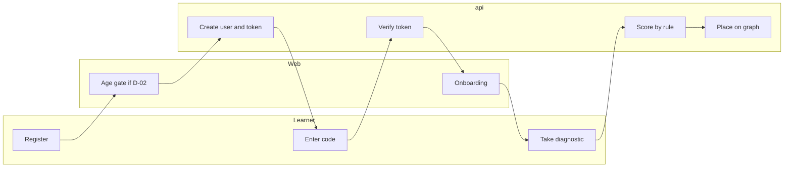

| Step | Lane | Decider | State change | Event | Idempotency key | Audit | Failure path |
|---|---|---|---|---|---|---|---|
| Register | api | DET | `User` created, `VerificationToken` | `UserRegistered` (planned) | unique email | none today | `EMAIL_ALREADY_REGISTERED` |
| Verify | api | DET | user verified | none | token single use | none today | `INVALID_OTP`, `EXPIRED_OTP` |
| Age gate | Web, api | DET | age band stored (only if D-02) | `AgeBandSet` (planned) | per user | `USER_AGE_BAND_SET` (planned) | block signup |
| Serve diagnostic | api | DET | `QuizAttempt` created | none | per user and quiz | none | retry |
| Score | api | DET | `Answer.isCorrect` set server side (`QuizEvaluationService`, unwired) | `DiagnosticCompleted` (planned) | `diagnostic:<attemptId>` | none | attempt kept, rescored |
| Place | api | DET | `TopicMasteryRecord` initial rows | `PlacementComputed` (planned) | `placement:<attemptId>` | none | default to first node |

---

## BP-02 Learning loop

Label: `partial`. Replaces the earlier flow "AI learner profiling, then personalized curriculum generation" (K-12): diagnostic, deterministic placement on the prerequisite graph, AI explains and proposes, the policy decides the next activity.

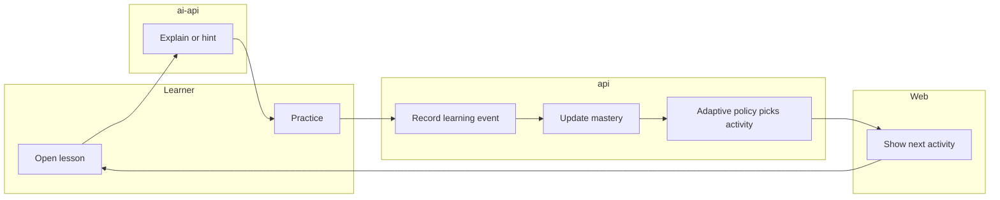

| Step | Lane | Decider | State change | Event | Idempotency key | Audit | Failure path |
|---|---|---|---|---|---|---|---|
| Explain | ai-api | AI | none | none | none | `DecisionTrace` | `AGENT_BUDGET_EXCEEDED` |
| Practice | api | DET | answer scored by rule | `ActivityCompleted` (planned) | `activity:<userId>:<stepId>:<attemptNo>` | none | reject unscored |
| Record | api | DET | `LearningEvent` row (no writer today) | `LearningEventRecorded` (planned) | unique `(userId, idempotencyKey)` exists in schema | none | duplicate is a no-op |
| Mastery | api | DET | `TopicMasteryRecord` and `StepMasteryRecord` updated by a corrected Elo-like rule (D-08) | `MasteryUpdated` (planned) | `mastery:<eventId>` | `DecisionTrace` | event kept, retried |
| Next activity | api | DET | difficulty inside the zone of proximal development; prerequisite below `theta` is remediated first | `NextActivityDecided` (planned) | `next:<userId>:<eventId>` | `DecisionTrace` | fall back to the next unlocked node |
| Rationale | ai-api | AI | none | none | none | `DecisionTrace` | show policy text only |

---

## BP-03 Sandbox attempt

Label: `partial (engine only)`. `AccountingSandboxService` has validate, post, trial balance and close; it has no route and no module (VD S-16, VF-04) and a compound-entry defect (VF-03).

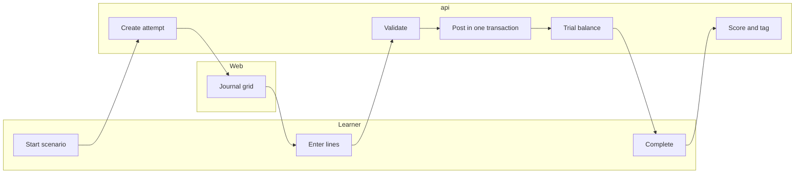

| Step | Lane | Decider | State change | Event | Idempotency key | Audit | Failure path |
|---|---|---|---|---|---|---|---|
| Start | api | DET | `SandboxAttempt` | `SandboxAttemptStarted` (planned) | `Idempotency-Key` header | none | `NOT_FOUND` scenario |
| Draft | api | DET | draft lines stored | none | `(attemptId, seq)` | none | keep draft |
| Validate | api | DET | no change | none | none | none | typed error codes: `UNBALANCED`, `INVALID_ACCOUNT`, `PERIOD_CLOSED` |
| Post | api | DET | `SandboxTransaction` and lines in one `$transaction` | `JournalEntryPosted` (planned) | `post:<attemptId>:<entryId>` | none | roll back whole entry |
| Trial balance | api | DET | none | none | none | none | recompute |
| Score and tag | api | DET | score by rule; misconception tags by rule | `ScenarioCompleted`, `MisconceptionDetected` (planned) | `complete:<attemptId>` | `DecisionTrace` | keep attempt open |
| Explain mistakes | ai-api | AI | none | none | none | `DecisionTrace` | show rule text only |

---

## BP-04 Creator application and tenant provisioning

Label: `implemented` on the API: submit, edit while pending, admin approve or reject, role upgrade and tenant with `OWNER` membership in one transaction, audited. No UI.

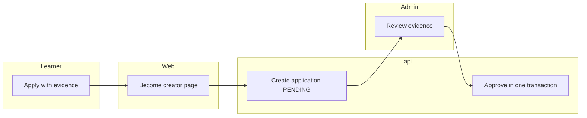

| Step | Lane | Decider | State change | Event | Idempotency key | Audit | Failure path |
|---|---|---|---|---|---|---|---|
| Submit | api | DET | `TeacherApplication` `PENDING` | none | one open application per user | none today | `409` duplicate |
| Review | Admin | HUMAN | none | none | none | none | request changes |
| Approve | api | DET after HUMAN | role `TEACHER`; `Tenant` and `TenantMembership` `OWNER` (repeat-safe) | none | tenant once per owner | `TEACHER_APPLICATION_APPROVED`, `TENANT_CREATED`, `USER_ROLE_CHANGED` | transaction rolls back |
| Reject | api | DET after HUMAN | status `REJECTED` | none | one decision | `TEACHER_APPLICATION_REJECTED` | none |
| Settings | api | DET | `TenantSettings` row (never created today) | none | unique `tenantId` | none | payout blocked until set (D-07) |

---

## BP-05 Content authoring, review, publish, unpublish

Label: `partial`. Authoring, versions, moderation by `ADMIN`, marketplace read exist; reviewer capability, rubric, UI and `If-Match` do not.

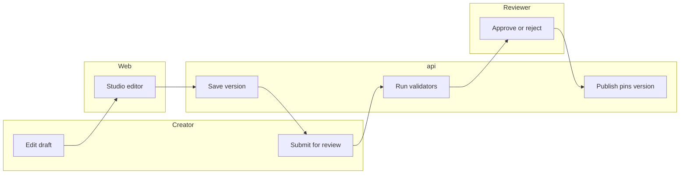

| Step | Lane | Decider | State change | Event | Idempotency key | Audit | Failure path |
|---|---|---|---|---|---|---|---|
| Draft | api | DET | `Article` `DRAFT`, `ArticleVersion` | none | `(articleId, versionNumber)` unique | `ARTICLE_CREATED` | `CONTENT_LOCKED` when not editable |
| Validate | api | DET | none | none | none | none | list of issues (prerequisites, required fields; sandbox scenario for procedural articles, planned) |
| Submit | api | DET | `PENDING_REVIEW` | none | state table | row per change | `INVALID_STATE_TRANSITION` |
| Decide | Reviewer | HUMAN | `PUBLISHED` or `REJECTED` with note | `ArticlePublished` (exists) | `ArticlePublished:<articleId>` dedupe | `ARTICLE_APPROVED` | creator edits, resubmits |
| Unpublish | api | DET after HUMAN | `SUSPENDED` (admin) or `ARCHIVED` | none | state table | `ARTICLE_ARCHIVED` | entitlements keep existing buyers |

---

## BP-06 Order, payment, fulfilment

Label: `implemented` on the API; web has order list, pay and submitted pages that call URLs and routes the API does not serve (VD VF-20) and no admin queue.

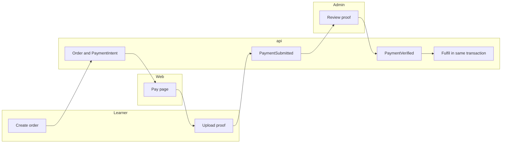

| Step | Lane | Decider | State change | Event | Idempotency key | Audit | Failure path |
|---|---|---|---|---|---|---|---|
| Create | api | DET | `Order` `PENDING`, `OrderItem` snapshot, `PaymentIntent` | `PaymentCreated` | per-user advisory lock and open-order lookup | `ORDER_CREATED` | `ALREADY_OWNED`, `PAYMENT_PROVIDER_UNAVAILABLE` (`503` without accounts) |
| Submit proof | api | DET | `ManualPaymentSubmission` `SUBMITTED` | `PaymentSubmitted` | one open proof per intent (partial unique index) | `MANUAL_PAYMENT_SUBMITTED` | `PAYMENT_EXPIRED` |
| Review | Admin | HUMAN | `UNDER_REVIEW` then `APPROVED` or rejected | none | one approved proof per intent | `MANUAL_PAYMENT_APPROVED` | resubmit up to `MANUAL_PAYMENT_MAX_SUBMISSIONS` |
| Verify | api | DET | `PaymentTransaction` `CAPTURE`, intent `PAID` | `PaymentVerified` | one successful capture per intent | `PAYMENT_INTENT_VERIFIED` | whole transaction rolls back |
| Fulfil | api | DET | order `PAID` then `FULFILLED`, `Entitlement`, `ClassEnrollment`, `CreatorEarning`, ledger entries | `EntitlementGranted`, `CreatorEarningCreated`, `OrderFulfilled` | `order-payment:<intent>`, `platform-fee:<item>`, `creator-earning:<item>` | `ORDER_FULFILLMENT_COMPLETED` | consumer error rolls back the approval |

---

## BP-07 Earning release, wallet credit, payout

Label: `partial`. Release and payout work; hold defaults to 0; `releaseDue` has no caller and no scheduler exists (VD VF-10); there is no scheduled ledger reconciliation.

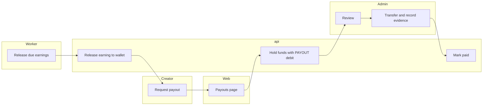

| Step | Lane | Decider | State change | Event | Idempotency key | Audit | Failure path |
|---|---|---|---|---|---|---|---|
| Release | api or Worker | DET | earning `AVAILABLE`; ledger `WALLET_CREDIT` | `CreatorEarningReleased` (declared, not emitted) | `wallet-credit:<earningId>` | none today | skip if not `PENDING` |
| Request | api | DET | `PayoutRequest` `REQUESTED`; ledger `PAYOUT` debit holds funds; wallet row locked | `PayoutRequested` | `payout:<payoutId>`; one open request per wallet | `PAYOUT_REQUESTED` | `PAYOUT_EXCEEDS_BALANCE`, tenant not active |
| Review | Admin | HUMAN | `UNDER_REVIEW`, `APPROVED` | `PayoutApproved` | state table | `PAYOUT_REVIEW_STARTED`, `PAYOUT_APPROVED` | `REJECTED` returns funds by ledger reversal |
| Pay | Admin | HUMAN | `PAID` with evidence file owned by the admin's upload prefix | `PayoutPaid` | state table | `PAYOUT_PAID` | `INVALID_STATE_TRANSITION` |
| Cancel | api | DET | `CANCELLED`, funds returned | `PayoutCancelled` | reversal key per entry | `PAYOUT_CANCELLED` | none |
| Reconcile | Worker | DET | report only (planned) | `LedgerReconciled` (planned) | `recon:<period>` | `LEDGER_RECONCILED` (planned) | alert on non-zero diff |

---

## BP-08 Refund

Label: `implemented` on the API: full refund only; buyer window `REFUND_WINDOW_DAYS` (default 7); admin bypasses the window; refusal when the content was consumed (`assertNotConsumed`).

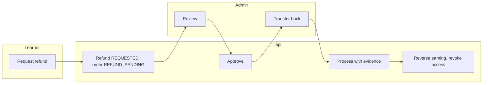

| Step | Lane | Decider | State change | Event | Idempotency key | Audit | Failure path |
|---|---|---|---|---|---|---|---|
| Request | api | DET | `Refund` `REQUESTED` (amount equals the intent amount), intent `REFUND_PENDING`, order `REFUND_PENDING`; one open refund per payment | `RefundRequested` | partial unique index `Refund_one_open_per_payment` | `REFUND_REQUESTED` | `INVALID_ORDER_STATE`, window closed, consumed |
| Review | Admin | HUMAN | `APPROVED` through the provider adapter, or `REJECTED` and order back to `FULFILLED` | `RefundApproved` | state table | `REFUND_APPROVED`, `REFUND_REJECTED` | none |
| Process | Admin | HUMAN | `PROCESSED` with evidence | `RefundCompleted` | state table | `REFUND_PROCESSED` | none |
| Reverse | api | DET | order `REFUNDED`; ledger `REFUND` debit; earning `REVERSED` and ledger reversals; entitlement `REVOKED`; enrollment `CANCELLED` | none | `refund:<refundId>`, `refund-reversal:<refundId>:<entryId>` | `REFUND_EFFECTS_APPLIED` | `REFUND_EXCEEDS_BALANCE` when the creator already withdrew |

---

## BP-09 AI credits

Label: `planned`. Package purchase through the order pipeline, earn rule, reserve, run, settle or release, expiry. The current service stores a reservation as a mutable ledger row and cannot work against the append-only trigger (VD VF-01); the plan uses a separate reservation table (`13-data-model-delta.md`).

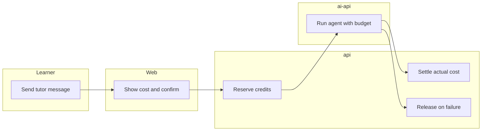

| Step | Lane | Decider | State change | Event | Idempotency key | Audit | Failure path |
|---|---|---|---|---|---|---|---|
| Buy package | api | DET | order item `AI_CREDIT_PACKAGE`; on `PaymentVerified` a `PURCHASE` ledger entry and wallet balance | `CreditPurchased` (planned) | `credit-purchase:<orderItemId>` | `CREDIT_PURCHASED` (planned) | refund reverses (D-06) |
| Earn | api | DET | `EARN` entry under a rule with daily cap | `CreditEarned` (planned) | `earn:<ruleId>:<userId>:<day>` | none | cap reached, no entry |
| Reserve | api | DET | `AICreditReservation` `HELD`, wallet `reserved` incremented in one transaction | `CreditReserved` (planned) | `Idempotency-Key` header | none | `INSUFFICIENT_AI_CREDITS` |
| Run | ai-api | AI | none | none | `x-idempotency-key` | `Episode`, `DecisionTrace` | `AGENT_BUDGET_EXCEEDED` |
| Settle | api | DET | reservation `SETTLED`, `SPEND` entry for actual amount, refund of the unused part | `CreditSettled` (planned) | `settle:<reservationId>` | none | timeout releases |
| Release | api | DET | reservation `RELEASED` | `CreditReleased` (planned) | `release:<reservationId>` | none | sweep of expired holds |
| Expire | Worker | DET | `EXPIRE` entry per package rule | `CreditExpired` (planned) | `expire:<entryId>` | none | none |

---

## BP-10 Agent publication

Label: `planned`; starts only after D-09 preconditions (tool registry, sandbox runtime, evaluation harness, incident handling).

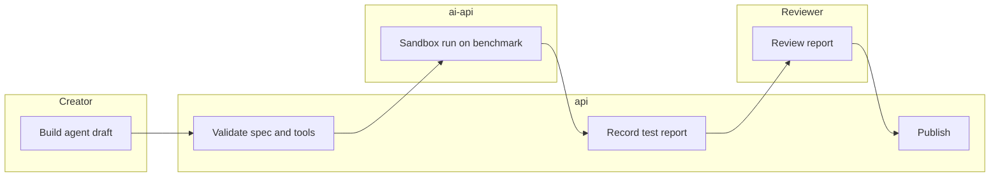

| Step | Lane | Decider | State change | Event | Idempotency key | Audit | Failure path |
|---|---|---|---|---|---|---|---|
| Draft | api | DET | `AIAgentProduct` `DRAFT` | none | `(ownerId, slug)` | `AGENT_CREATED` (planned) | validation list |
| Sandbox | ai-api | DET | `SANDBOX`, then `VALIDATING` on pass | `AgentSandboxPassed` (planned) | `agent-test:<agentId>:<version>` | `AgentTestReport` | back to `DRAFT` with report |
| Judge | ai-api | AI | score only | none | none | `AgentTestReport` | threshold fail returns to `DRAFT` |
| Review | Reviewer | HUMAN | `REVIEW` to `PUBLISHED` with approval id | `AgentPublished` (planned) | state table | `AGENT_APPROVED` (planned) | `DRAFT` with notes |
| Incident | api | DET | `SUSPENDED` | `AgentIncidentRaised` (planned) | `incident:<traceId>` | `AgentIncident` | admin un-suspends with approval |

---

## BP-11 Prompt or policy promotion

Label: `planned`; preconditions in `07-ai-architecture.md` §10 (episode writer live, frozen benchmark, judge agreement, gate, canary, rollback).

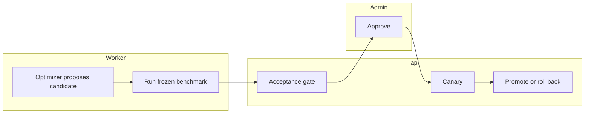

| Step | Lane | Decider | State change | Event | Idempotency key | Audit | Failure path |
|---|---|---|---|---|---|---|---|
| Candidate | Worker | AI | `PromptVersion` `EXPERIMENTAL` | `CandidateProposed` (planned) | `candidate:<runId>:<n>` | `OptimizationRun` | discard |
| Benchmark | Worker | DET | scores per component, never one number | none | `bench:<candidate>:<benchmarkVersion>` | `OptimizationRun` | gate fails |
| Gate | api | DET | `VALIDATED` or `REJECTED` | none | `gate:<candidate>` | `PROMPT_GATE_DECIDED` (planned) | candidate rejected |
| Approve | Admin | HUMAN | `ACTIVE` for canary share | `PromptPromoted` (planned) | approval id | `PROMPT_PROMOTED` (planned) | admin rejects |
| Canary | api | DET | traffic share, metrics | none | none | `DecisionTrace` | automatic rollback on regression |

---

## BP-12 Creator eligibility and stage promotion

Label: `planned`; rules in `03-actors-and-journeys.md` §2.

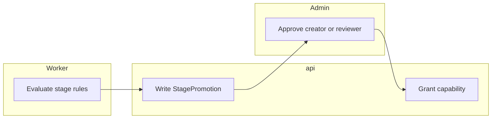

| Step | Lane | Decider | State change | Event | Idempotency key | Audit | Failure path |
|---|---|---|---|---|---|---|---|
| Evaluate | Worker | DET | none | none | none | none | next run |
| Record | api | DET | `StagePromotion` row with input snapshot | `StagePromoted` (planned) | `stage:<userId>:<stage>` | `STAGE_PROMOTED` (planned) | duplicate no-op |
| Grant | api | DET after HUMAN | creator: role and tenant (BP-04); reviewer: capability flag | none | one grant per user and capability | `CAPABILITY_GRANTED` (planned) | admin declines |
| Revoke | api | HUMAN | capability removed on incident | none | state table | `CAPABILITY_REVOKED` (planned) | none |

---

## Acceptance criteria

| Criterion | Test |
|---|---|
| Every implemented process has a passing spec for its idempotency keys | `payment-flow.int.spec.ts`, `payouts.int.spec.ts`, `refunds.int.spec.ts` on a scratch database |
| Every planned process names its state table before code starts | `13-data-model-delta.md` and `11-api-plan.md` |
| No `AI` decider appears in a step that changes money, role, publication or grade | Decision authority matrix, `07-ai-architecture.md` §2 |
