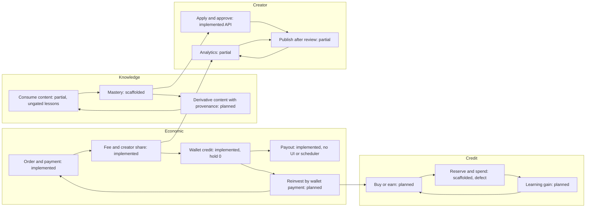

# Circular Economy

> **Status**: `planned` · **Owner**: `product-strategist` · **Last reviewed**: `2026-10-02`
>
> Four loops bound to entities and events, with the place where each loop closes today, where it leaks, the fix and the stage, plus component KPIs and six guardrails that must not get worse.

Facts: [`01-verification-delta.md`](./01-verification-delta.md) (VD). The design intent is in [`../architecture/circular-economy-model.md`](../architecture/circular-economy-model.md) (planned, not state); this file follows its §5 KPI list and §7 forbidden metrics, and resolves K-11 with caps on credit earning.

Rules that apply to every table below: no single opaque circularity score; page views, clicks and time-on-app are not evidence; physical-material circularity is out of scope; the commerce wallet (real IDR) and the AI credit wallet (closed loop) stay separate, and value moves from the commerce side to the credit side in one direction only, through the order pipeline.

---

## 1. Where the loops close

The loops connect at four points: creator earnings feed creator analytics (`E2` to `R3`); mastery feeds creator eligibility (`K2` to `R1`); wallet balance can buy credits and products (`E5` to `C1` and `E1`); a derivative article re-enters consumption (`K3` to `K1`).

---

## 2. Economic loop

| Arrow | Entity or event | Implemented | Leak or break today | Fix | Stage |
|---|---|---|---|---|---|
| Purchase | `Order`, `OrderItem` snapshot | yes | `Order.amount Float`, `snapToken`, `gateway` deprecated columns remain (VD §3.1) | Drop after a dual-read window | 3 |
| Payment | `PaymentIntent`, `PaymentVerified` | yes (manual) | One admin approves proofs; no admin UI | Admin payment queue UI; second admin (D-20) | 2 |
| Platform fee | `OrderItem.platformFee`, ledger `PLATFORM_FEE` | yes | Fee percent only from env, no per-tenant override | Keep until data exists (D-05) | none |
| Creator share | `CreatorEarning` `PENDING`, ledger `CREATOR_EARNING` | yes | Topic sales create no earning (no tenant) | Retire Topic as product (D-16) | 2 |
| Wallet credit | `releaseDue`, ledger `WALLET_CREDIT`, `CreatorEarningReleased` | partial | Hold defaults to 0, so earnings release at fulfilment and can leave before the refund window; with a non-zero hold nothing releases (`releaseDue` has no caller, no scheduler) (VD HC-13, VF-10) | BullMQ repeatable job; hold at least refund window | 3 |
| Payout | `PayoutRequest`, ledger `PAYOUT` | yes (API) | No UI; destination typed per request, `TenantSettings` unused | Studio payouts, admin finance UI; destination in settings | 3 |
| Reinvest | `WALLET` payment adapter producing `PaymentVerified` | no | Wallet funds can only leave by payout | Adapter on the existing abstraction (D-07, D-14) | 3 |
| Re-purchase | second `Order` by the same user | yes | none measured | KPI-M1 | 2 |
| Refund (reverse arrow) | `Refund`, earning `REVERSED` | yes | A refund fails with `409` after the creator withdrew | Hold at least the refund window (D-05) | 3 |

Known break confirmed and refined: the earning does not stay `PENDING` by default; it stays `PENDING` forever when a hold is configured, because the job that releases it is missing.

---

## 3. Knowledge loop

| Arrow | Entity or event | Implemented | Leak or break today | Fix | Stage |
|---|---|---|---|---|---|
| Consume | `Entitlement`, lesson and step reads, `LessonProgress` | partial | Curriculum reads are `@AuthenticatedOnly()` and not entitlement-gated (VD VF-14) | Gate by free topic or entitlement | 0 |
| Mastery | `TopicMasteryRecord`, `LearningEvent` | no | Writer missing; formula saturates (VF-02) | Corrected rule, event writer | 1 |
| Derivative content | `Article` with `sourceRefs` on `ArticleVersion` | no | No provenance field | Additive column or reference table (`13-data-model-delta.md`) | 5 |
| Reuse | reference table, KPI-L4 | no | Not measurable | Same table | 5 |
| Attribution | source shown on the product page | no | none | UI component `ProvenanceList` | 5 |

---

## 4. AI credit loop

| Arrow | Entity or event | Implemented | Leak or break today | Fix | Stage |
|---|---|---|---|---|---|
| Buy | order item `AI_CREDIT_PACKAGE`, `PURCHASE` entry | no | `OrderItem_exactly_one_product` admits three product columns; `AICreditPackage` has no writer (VD S-07) | Additive nullable column and a rewritten CHECK | 4 |
| Earn | `EARN` entry under a rule | no | No rule; the design doc earns from streaks, which is a farming risk (K-11) | Earn only from verified learning events, capped per day (`08-gamification-and-theme.md` §1) | 4 |
| Reserve | `AICreditReservation` | no | Existing service updates an append-only row (VF-01) | New table, one row per hold, ledger written only at settle | 4 |
| Spend | `SPEND` entry at settle | no | No caller | Tutor route reserves, calls, settles through `api` (D-13) | 4 |
| Learning gain | mastery change after AI-assisted practice | no | Not measured | Pre and post on sandbox scenarios (D-19) | 5 |
| Expire | `EXPIRE` entry | no | No job | Repeatable job | 4 |

---

## 5. Creator loop

| Arrow | Entity or event | Implemented | Leak or break today | Fix | Stage |
|---|---|---|---|---|---|
| Learner becomes creator | `TeacherApplication`, `TenantMembership` | yes (API) | No UI; no evidence field tied to mastery (D-04) | `/become-creator` with evidence upload and mastery snapshot | 2 |
| Publishes | `ArticleVersion`, `ArticlePublished`, `ClassPublished` | partial | Only `ADMIN` reviews (K-09) | Reviewer capability (D-12), review queue | 2 |
| Reads analytics | `creator-analytics` routes | partial | Two routes, no studio screen with outcomes | Studio overview with buyers, completion, mastery gain | 2 |
| Improves | new `ArticleVersion` | yes (API) | No `If-Match`; no prompt to update from analytics | Optimistic concurrency; stale-content nudge | 2 |
| Reinvests | `WALLET` payment | no | See economic loop | Same adapter | 3 |

---

## 6. KPIs

Every KPI has a formula, a source, a window, a privacy scope and a limitation. Privacy scope `aggregate` means reported only for cohorts of at least `k_min` learners [ASSUMPTION: `k_min` is a parameter, no value set]; no per-user figure leaves the learner's own view. Status: `computable` from existing tables, `needs writer`, or `needs table`.

### 6.1 Learning

| ID | KPI | Formula | Source | Window | Privacy | Limitation | Status |
|---|---|---|---|---|---|---|---|
| KPI-L1 | Lesson reuse rate | learners with a completed lesson created at least 180 days earlier / learners enrolled in the window | `LessonProgress`, `Lesson.createdAt` | 90 days | aggregate per topic | Completion is not learning | computable |
| KPI-L2 | Product update rate | published articles with a new published version in the window / published articles | `ArticleVersion.publishedAt` | 90 days | per tenant, aggregate | Classes have no versions | computable (articles) |
| KPI-L3 | Question reuse | questions used in at least 3 lessons / questions | `Question`, `Quiz` | 90 days | aggregate | A question belongs to one quiz, so reuse is zero by schema | needs table |
| KPI-L4 | Knowledge reuse | resources referenced by at least 2 topics / resources | reference table (planned) | 90 days | aggregate | Needs provenance data | needs table |

### 6.2 Creator

| ID | KPI | Formula | Source | Window | Privacy | Limitation | Status |
|---|---|---|---|---|---|---|---|
| KPI-C1 | Learner to creator conversion | creators approved in the window / Practitioners at window start | `TeacherApplication`, `StagePromotion` | 90 days | aggregate | Needs stage records | needs table |
| KPI-C2 | Creator retention | creators with at least one published product active at month 12 / creators who published in the cohort month | `Article`, `ClassProduct` status | 12 months | per tenant, aggregate | Small early cohorts | computable |
| KPI-C3 | Reinvestment rate | sum of orders paid with a `WALLET` intent by creators / sum of `WALLET_CREDIT` in the window | `LedgerTransaction`, `PaymentIntent.provider` | 30 days | per creator visible to the creator, aggregate to staff | Needs the wallet adapter | needs table |
| KPI-C4 | Remix rate | new published versions with at least one source reference / new published versions | `ArticleVersion`, reference table | 90 days | aggregate | Reference quality is self-declared | needs table |

### 6.3 AI credit

| ID | KPI | Formula | Source | Window | Privacy | Limitation | Status |
|---|---|---|---|---|---|---|---|
| KPI-A1 | Earn rate | credits earned / active learners / weeks | `AICreditLedgerEntry` type `EARN` | 28 days | aggregate | Active learner defined by a qualifying learning event | needs writer |
| KPI-A2 | Spend rate | credits spent / active learners / weeks | `SPEND` entries | 28 days | aggregate | Includes purchased credits | needs writer |
| KPI-A3 | Earn to spend ratio | earned credits / spent credits | A1, A2 | 28 days | aggregate | Both directions are risks: above `r_hi` signals farming or liability, below `r_lo` signals no incentive; bounds are parameters | needs writer |
| KPI-A4 | Expiry rate | credits expired unspent / credits issued | `EXPIRE`, `PURCHASE`, `EARN` | 90 days | aggregate | Depends on the expiry rule (D-06) | needs writer |

### 6.4 Marketplace

| ID | KPI | Formula | Source | Window | Privacy | Limitation | Status |
|---|---|---|---|---|---|---|---|
| KPI-M1 | Free to paid conversion | learners with a free entitlement who bought a paid product within 90 days / learners with a free entitlement | `Entitlement`, `Order` | 90 days | aggregate | Confounded by promotions | computable |
| KPI-M2 | Paid to creator conversion | buyers who later became creators / buyers | `Order`, `TeacherApplication` | 180 days | aggregate | Long lag | computable |
| KPI-M3 | Class completion | enrollments `COMPLETED` / paid enrollments | `ClassEnrollment` | 90 days | per tenant, aggregate | Articles have no completion state | computable (classes) |
| KPI-M4 | Median approval time | median of (`PaymentVerified` time minus `PaymentSubmitted` time) | `DomainEvent` | 30 days | aggregate | Admin availability | computable |

### 6.5 Sandbox

| ID | KPI | Formula | Source | Window | Privacy | Limitation | Status |
|---|---|---|---|---|---|---|---|
| KPI-S1 | Scenario reuse | scenarios completed by at least one learner / published scenarios | `SandboxAttempt` | 90 days | aggregate | Needs seeded scenarios | needs writer |
| KPI-S2 | First-attempt valid-entry rate | entries that pass `validate` on the first call / entries submitted | sandbox events | 28 days | aggregate | Measures mechanics, not understanding | needs writer |
| KPI-S3 | Mastery lift | standardized mean difference between post and pre scores on the same scenarios, with a confidence interval | pre and post attempts | pilot term | aggregate, cohort at least `k_min` | Small samples give wide intervals; no control group unless D-19 adds one | needs writer |

### 6.6 System health

| ID | KPI | Formula | Source | Window | Privacy | Limitation | Status |
|---|---|---|---|---|---|---|---|
| KPI-H1 | Active learners | users with at least one qualifying learning event | `LearningEvent` | 28 days | aggregate | A qualifying event excludes logins and page views | needs writer |
| KPI-H2 | RAG retrieval precision | relevant retrieved chunks / retrieved chunks on a labeled set | frozen benchmark | per release | none | Needs labeled set (D-10) | needs table |

---

## 7. Guardrails

A release that worsens any guardrail beyond its tolerance does not ship; tolerances are parameters set after the first baseline.

| ID | Guardrail | Definition | Source | Worse means |
|---|---|---|---|---|
| G-1 | Learning gain | KPI-S3 | pre and post attempts | effect size drops below `e_min` |
| G-2 | Sandbox correctness | KPI-S2 on engine-graded entries; engine golden tests pass | sandbox events | rate falls or any golden test fails |
| G-3 | Refund rate | refunds `PROCESSED` / orders `FULFILLED`, 30 days | `Refund`, `Order` | rate exceeds `r_ref` |
| G-4 | Content rejection rate | `REJECTED` / submitted for review, 30 days | `Article`, `ClassProduct` status | rate exceeds `r_rej` (low quality supply) or falls to near zero with reviewer agreement dropping (rubber stamp) |
| G-5 | Credit earn to spend ratio | KPI-A3 | `AICreditLedgerEntry` | outside `[r_lo, r_hi]` |
| G-6 | AI cost per active learner | sum of settled provider cost / KPI-H1, 28 days | `DecisionTrace` cost, ledger | exceeds `B_llm / active learners` (D-21) |

## 8. Trade-offs

| Choice | Alternative | Why |
|---|---|---|
| Component KPIs with limitations | One circularity score | A score hides which loop leaks and invites gaming |
| Earn caps and verified events for credits | Streak-based earning | K-11: streaks reward visits, which the model lists as an anti-pattern |
| Pilot-measured thresholds | Fixed targets now | No baseline exists; invented targets would be fabricated facts |
