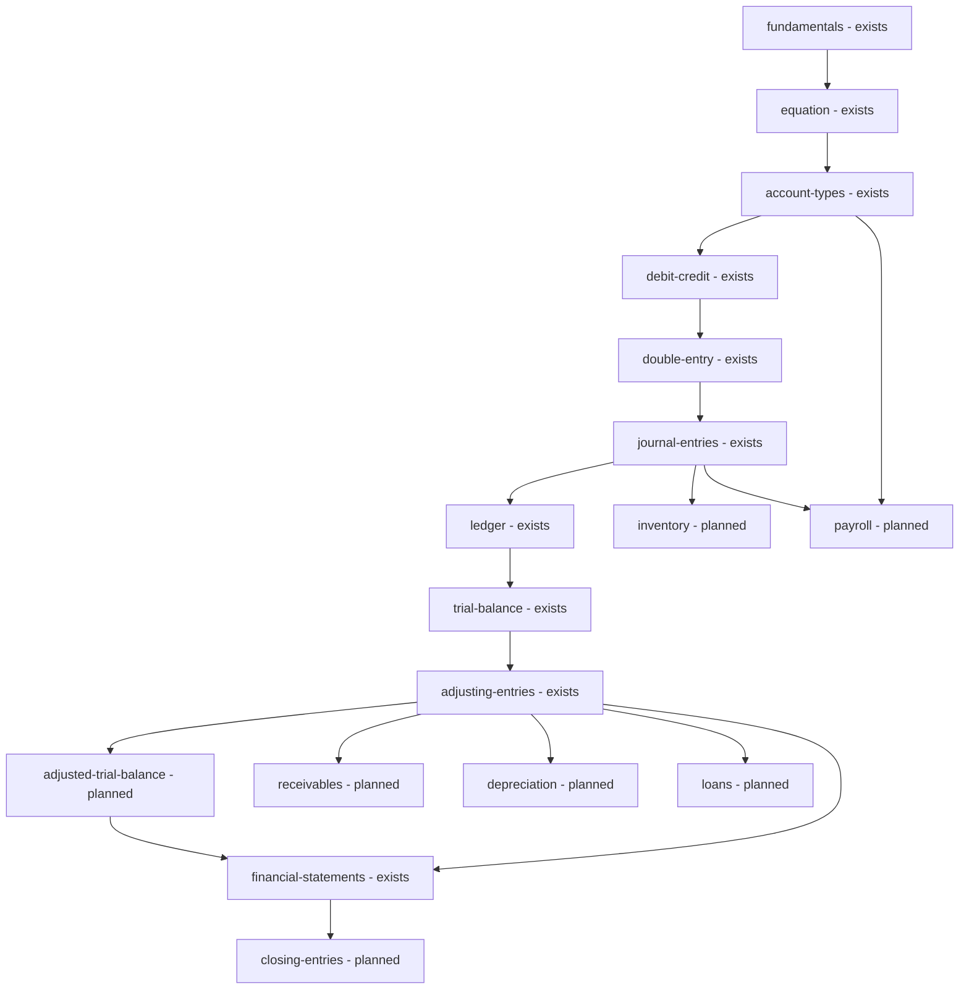

# Accounting Domain and Sandbox

> **Status**: `planned` · **Owner**: `accounting-architect` · **Last reviewed**: `2026-10-02`
>
> Extends the implemented golden graph and sandbox tables into a complete practice domain: skill levels as a projection of the graph, a corrected engine contract, a scenario format, deterministic grading with partial credit, and a misconception taxonomy, with AI limited to explaining and drafting.

Facts: [`01-verification-delta.md`](./01-verification-delta.md) (VD). Design intent being reconciled: [`../architecture/accounting-sandbox.md`](../architecture/accounting-sandbox.md) (K-02). Decisions: D-15 (standard profile), D-18 (authorship), D-08 (mastery). Segment: D-01 A [ASSUMPTION].

---

## 1. Golden graph inventory

### 1.1 Implemented

Ten sub-topics in one linear chain, nine prerequisite edges, one topic `akuntansi-dasar-golden-graph`; seeded by `seed-golden-graph.ts`; table `SubTopicPrerequisite` with a no-self-edge CHECK and a unique pair [VERIFIED: `seed-golden-graph.ts:25-170`, migration `20261001090000_sub_topic_prerequisites`]. Cycle prevention is intended in `PrerequisiteService`, which has no module, checks the wrong direction (VD VF-21) and whose spec skips without a database (VD VF-04).

### 1.2 Target graph

The v1 topics map as: accounting equation = `equation`; debit and credit = `debit-credit`; journal entry = `journal-entries`; ledger = `ledger`; trial balance = `trial-balance`. Added nodes are marked `planned`; existing edges are never edited, new edges are inserted.



| Node | Status | Prerequisites | Depth | Level |
|---|---|---|---|---|
| `fundamentals`, `equation`, `account-types` | exists | chain | 0, 1, 2 | Beginner |
| `debit-credit`, `double-entry`, `journal-entries`, `ledger`, `trial-balance` | exists | chain | 3 to 7 | Fundamental |
| `inventory`, `payroll` | planned | `journal-entries` (and `account-types` for payroll) | 6 | Fundamental |
| `adjusting-entries`, `adjusted-trial-balance`, `financial-statements` | exists, planned, exists | chain | 8, 9, 10 | Financial |
| `receivables`, `depreciation`, `loans` | planned | `adjusting-entries` | 9 | Financial |
| `closing-entries` | planned | `financial-statements` | 11 | Advanced |

### 1.3 Skill tree levels

Levels are a projection of the graph, never a second structure: `level(node) = bucket(longest path from any root)` with the boundaries Beginner 0 to 2, Fundamental 3 to 7, Financial 8 to 10, Advanced 11 and above [ASSUMPTION: boundaries are parameters reviewed with a lecturer]. The projection is a view or a pure function; no column stores it.

---

## 2. Reconciliation of the planned design with the implemented tables (K-02)

The migration `20261001100000_accounting_sandbox` wins. All changes below are additive, written as new migrations, never edits of applied files. The sandbox tables have no data in any database (`SandboxAccount`, `SandboxScenario`, `SandboxAttempt` have no writer; the service is unwired), so replacing a constraint is safe [VERIFIED: VD S-03].

| Planned design | Implemented | Gap | Additive change |
|---|---|---|---|
| `ChartOfAccounts` | none; `SandboxAccount.code` is globally unique | Two scenarios cannot reuse account codes | New `SandboxChart`; nullable `SandboxAccount.chartId`; unique `(chartId, code)` replaces unique `(code)` in a new migration |
| `SandboxAccount.type` enum with contra types | `type String` | Free text | New enum `SandboxAccountType`; backfill by mapping, then switch |
| `SandboxPeriod` with dates and status | `label`, `isClosed`, `closedAt` | No dates, no `CLOSING` | Add `chartId`, `startDate`, `endDate`, `status`; keep `isClosed` until removed |
| `SandboxScenario` with steps and expected outcome | `name`, `description` | No content | Add `ownerId`, `standardProfile`, `difficulty`, `mode`; rows `SandboxScenarioEvent` and `SandboxExpectedLine` (§4) |
| `JournalEntry` and `JournalLine(accountId, direction, amount)` | `SandboxTransaction` and `SandboxJournalLine(debitAccountId, creditAccountId, amount)` | The pair line cannot hold a compound entry without allocating amounts; VD VF-03 | New `SandboxEntryLine(transactionId, accountId, direction, amount, sequence)`; stop writing the pair table; drop it in a later migration |
| `LedgerEntry` | none | Trial balance recomputed from lines each time | No table: trial balance is a pure function over posted lines; cache only in `SandboxAttempt.resultJson` |
| `AdjustingEntry` | none | Adjusting entries cannot be told apart | `SandboxTransaction.kind` enum `OPERATING`, `ADJUSTING`, `CLOSING`, `REVERSING` instead of a separate table |
| Entry status `DRAFT`, `POSTED`, `REVERSED` | `postedAt`, `reversedBy String?` | Not a foreign key, no status | Add `status` enum and self FK `reversesId`; trigger blocks updates of posted rows |
| `FinancialStatement` | none | n/a | Computed by function; no table |
| `SandboxAttempt` with score, timestamps | `userId`, `scenarioId`, `createdAt` | No result, no mode, no completion | Add `mode`, `status`, `startedAt`, `completedAt`, `score`, `resultJson`, `learningEventId` |
| Currency `SANDBOX_IDR`, `simulation_only` | none | Nothing separates sandbox money from real money except the absence of foreign keys | Keep the hard boundary: no FK to commerce tables; add a test that fails if any sandbox model relates to a commerce model |

Missing for statements, adjusting entries, reversals and multi-period scenarios: statements (pure functions, §3.1), adjusting and closing entries (`kind`), reversals (`reversesId` and engine rule), multi-period carry-forward (`openPeriod(carryForwardFrom)` copies closing balances of real accounts into the next period as opening lines flagged `OPENING`).

---

## 3. Engine contract

### 3.1 Operations

```typescript
interface AccountingEngine {
  startAttempt(userId: string, scenarioId: string, mode: SandboxMode): Promise<Attempt>
  saveDraft(attemptId: string, actorId: string, entry: DraftEntry): Promise<DraftEntry>
  validate(attemptId: string, actorId: string, entryId: string): Promise<ValidationResult>
  post(attemptId: string, actorId: string, entryId: string, key: string): Promise<PostedEntry>
  reverse(attemptId: string, actorId: string, entryId: string, key: string): Promise<PostedEntry>
  trialBalance(attemptId: string, periodId: string): Promise<TrialBalance>
  statements(attemptId: string, periodId: string): Promise<Statements>
  closePeriod(attemptId: string, actorId: string, periodId: string): Promise<Period>
  complete(attemptId: string, actorId: string): Promise<AttemptResult>
}
```

`Statements` holds the income statement and the statement of financial position derived from the trial balance by the account type of each row; cash-flow is a later extension.

### 3.2 Invariants

| ID | Invariant | Enforced by |
|---|---|---|
| E-1 | Sum of debit lines equals sum of credit lines per posted entry, compared as `Decimal` with at most 4 decimal places | engine and a deferred constraint trigger at commit (database) |
| E-2 | Every line has an active account that belongs to the attempt's chart | engine; foreign key |
| E-3 | An entry posts only into an open period | engine with row lock on the period |
| E-4 | A posted entry is immutable; correction is a reversal | trigger on `SandboxTransaction` and lines (database) |
| E-5 | A reversal references its original, swaps every side, and re-balances; one reversal per original | engine; unique index on `reversesId` |
| E-6 | An attempt belongs to the caller; completed attempts accept no posting | engine, ownership registry entry `sandbox-attempt` |
| E-7 | No line has a non-positive amount and no entry has fewer than two lines | engine; CHECK on `amount > 0` exists |
| E-8 | A line debits and credits different accounts only through two lines, never through one pair | structure of `SandboxEntryLine` |
| E-9 | Sandbox rows never reference commerce rows | schema test |

### 3.3 Typed error codes

| Code | Meaning | HTTP |
|---|---|---|
| `JOURNAL_MIN_LINES` | Fewer than two lines | 422 |
| `JOURNAL_NON_POSITIVE_AMOUNT` | Amount at or below zero | 422 |
| `JOURNAL_UNBALANCED` | Debit total differs from credit total; details carry both | 422 |
| `AMOUNT_PRECISION` | More than 4 decimal places | 422 |
| `ACCOUNT_INACTIVE` | Unknown or inactive account | 422 |
| `PERIOD_NOT_FOUND` | Period not in the attempt's chart | 404 |
| `PERIOD_CLOSED` | Period rejects postings | 409 |
| `ENTRY_ALREADY_POSTED` | Entry posted before; idempotent replay returns the first result | 200 or 409 |
| `CANNOT_EDIT_POSTED` | Edit of a posted entry | 409 |
| `REVERSAL_TARGET_INVALID` | Not posted, already reversed, or a reversal itself | 409 |
| `ATTEMPT_NOT_OWNED` | Caller is not the owner | 404 |
| `ATTEMPT_COMPLETED` | Attempt already completed | 409 |

`JOURNAL_MIN_LINES`, `JOURNAL_NON_POSITIVE_AMOUNT`, `JOURNAL_UNBALANCED`, `ACCOUNT_INACTIVE`, `PERIOD_NOT_FOUND` and `PERIOD_CLOSED` already exist as strings in `accounting-sandbox.service.ts:38-106` and are kept.

### 3.4 Transaction boundary

`post` runs in one database transaction: lock the attempt row, lock the period row, re-validate, insert the transaction and its lines, set `postedAt` and `status`, write an audit row. A replay with the same `Idempotency-Key` returns the stored result. `reverse` creates a new `REVERSING` transaction with swapped sides and sets the original to `REVERSED` in the same transaction. Amounts are `Decimal` in storage and strings in HTTP; no floating-point arithmetic anywhere in the engine.

---

## 4. Virtual-company scenario format

A scenario is a company, a chart, periods, ordered business events, the expected entries per event, the expected trial balance per period, learning outcomes, prerequisites, difficulty and a mode. Stored as rows (`SandboxScenario`, `SandboxScenarioEvent`, `SandboxExpectedLine`) and exchanged as this document.

```json
{
  "id": "toko-buku-laut-01",
  "title": "Toko Buku Laut, bulan pertama",
  "standardProfile": "LOCAL_CURRICULUM",
  "mode": "PRACTICE",
  "difficulty": 0.3,
  "prerequisiteSlugs": ["journal-entries"],
  "learningOutcomes": ["Mencatat modal awal", "Mencatat pembelian perlengkapan secara tunai"],
  "chart": [
    { "code": "1100", "name": "Kas", "type": "ASSET" },
    { "code": "1300", "name": "Perlengkapan", "type": "ASSET" },
    { "code": "3100", "name": "Modal pemilik", "type": "EQUITY" }
  ],
  "periods": [{ "label": "2026-01", "startDate": "2026-01-01", "endDate": "2026-01-31" }],
  "events": [
    {
      "sequence": 1,
      "date": "2026-01-02",
      "period": "2026-01",
      "narrative": "Pemilik menyetor kas sebesar 50.000.000 untuk memulai usaha.",
      "expected": [
        { "account": "1100", "direction": "DEBIT", "amount": "50000000.0000" },
        { "account": "3100", "direction": "CREDIT", "amount": "50000000.0000" }
      ]
    },
    {
      "sequence": 2,
      "date": "2026-01-05",
      "period": "2026-01",
      "narrative": "Toko membeli perlengkapan secara tunai sebesar 2.000.000.",
      "expected": [
        { "account": "1300", "direction": "DEBIT", "amount": "2000000.0000" },
        { "account": "1100", "direction": "CREDIT", "amount": "2000000.0000" }
      ]
    }
  ],
  "expectedTrialBalance": {
    "2026-01": [
      { "account": "1100", "debit": "48000000.0000", "credit": "0.0000" },
      { "account": "1300", "debit": "2000000.0000", "credit": "0.0000" },
      { "account": "3100", "debit": "0.0000", "credit": "50000000.0000" }
    ]
  },
  "disclaimer": "Simulasi untuk belajar; bukan nasihat akuntansi profesional."
}
```

Modes:

| Mode | Hints | Grading | Timer | AI access |
|---|---|---|---|---|
| `LEARN` | Step-by-step, worked example allowed | Not recorded for mastery | none | Explain and hint by level |
| `PRACTICE` | Hint after an attempt | Recorded, partial credit | none | Explain after an attempt |
| `CHALLENGE` | None before submit | Recorded | optional | Comment after completion only |
| `EXAM` | None | Recorded, strict | yes | none |
| `AGENT_TEST` | n/a | Agent report, never feeds learner mastery | yes | The agent under test only |

---

## 5. Deterministic grading with partial credit

Each expected line is scored on four attributes: account, direction, amount, period. Weights are parameters [ASSUMPTION: `w_account` 0.4, `w_direction` 0.2, `w_amount` 0.3, `w_period` 0.1, sum 1, reviewed with a lecturer].

```text
line_score(e, a) = w_account*[a.account == e.account] + w_direction*[a.direction == e.direction]
                 + w_amount*[a.amount == e.amount] + w_period*[a.period == e.period]

matching: for each expected line in order, pick the unmatched actual line with the highest line_score,
          ties broken by smaller actual id; each actual line matches at most once

event_score = (sum of matched line_score) / (expected_lines + lambda * extra_actual_lines)

attempt_score = sum(difficulty_weight_event * event_score) / sum(difficulty_weight_event)
```

`lambda` is a parameter [ASSUMPTION: 0.5]. An amount match is exact on `Decimal`. A scenario passes when `attempt_score >= s_pass` [ASSUMPTION: parameter] and every event has an entry that the engine accepted. The score never comes from a model; ties and order are fixed so the same input always yields the same score. Misconception tags (§6) are computed from the same comparison.

---

## 6. Misconception taxonomy

Each code has a deterministic detection rule over expected and actual lines and an intervention. `Remediate` names the graph node to revisit. Rules run after grading; a tag needs a second occurrence in different events to become `confirmed` (lifecycle in `07-ai-architecture.md` §3).

| Code | Detection rule | Intervention | Remediate |
|---|---|---|---|
| `DC_REVERSAL` | Every actual line matches an expected line on account and amount with the opposite direction | Show the normal-balance table; worked example with the same accounts | `debit-credit` |
| `WRONG_ACCOUNT_TYPE` | Amount and direction match; the account type class differs from the expected account's | Ask which element of the equation changes; link the chart row | `account-types` |
| `ASSET_EXPENSE_CONFUSION` | Expected an asset account (supplies, equipment); actual an expense account, or the reverse | Contrast asset and expense with the benefit-period test | `account-types` |
| `ACCRUAL_MISSED` | An expected `ADJUSTING` event has no actual entry while the related cash event is posted | Timeline exercise: when the expense is incurred versus paid | `adjusting-entries` |
| `PERIOD_MISMATCH` | Lines match except `period` | Show the period boundary of the event date | `adjusting-entries` |
| `CONTRA_ACCOUNT_SIGN` | A contra account matches in amount but carries the same direction as its parent | Show parent and contra balance side by side | `adjusting-entries` |
| `SINGLE_SIDED_ENTRY` | Two or more `JOURNAL_UNBALANCED` results where one side total is 0 | Walk through "every transaction has two effects" | `double-entry` |
| `AMOUNT_TRANSPOSITION` | Actual amount equals the expected amount with two adjacent digits swapped | Prompt to re-read the narrative figure | `journal-entries` |
| `OMITTED_COMPONENT` | Actual amount equals expected minus a component the event declares (tax, freight, discount) | Highlight the component in the narrative | `journal-entries` |
| `REVENUE_EARLY` | Revenue credited in an event flagged `deferred` | Revenue recognition timeline | `adjusting-entries` |
| `EXPENSE_NOT_MATCHED` | Expense posted in a period different from the revenue it relates to (event flag `matchesWith`) | Matching principle example | `adjusting-entries` |
| `DRAWING_AS_EXPENSE` | Owner withdrawal debited to an expense account | Equity versus expense contrast | `account-types` |
| `LIABILITY_AS_REVENUE` | Customer deposit credited to revenue instead of a liability | Unearned revenue example | `account-types` |
| `CASH_CREDIT_CONFUSION` | Credit sale posted to cash, or a cash sale to receivable | Compare settlement timing | `journal-entries` |
| `DEPRECIATION_DIRECT_CREDIT` | Asset credited directly where the profile expects an accumulated depreciation contra account | Show the profile's presentation rule (D-15) | `depreciation` |
| `BALANCING_PLUG` | An actual line uses a suspense or rounding account to force balance | Ask which event the difference belongs to | `trial-balance` |
| `REVERSAL_OMITTED` | An expected `REVERSING` event has no entry | Show the opening-balance effect without the reversal | `adjusting-entries` |
| `CLOSING_MISSED` | Temporary accounts carry a balance after the closing event | Closing sequence walkthrough | `closing-entries` |
| `DUPLICATE_POSTING` | Two posted entries with identical lines for one event | Check the ledger for the event | `ledger` |

---

## 7. Role of AI

| Task | Allowed | Rule |
|---|---|---|
| Explain a mistake in Indonesian, with the rule text from §6 | yes | Receives the deterministic result; never changes it |
| Hint by level (`LEARN`, `PRACTICE`) | yes | Level set by the mode, not by the model |
| Draft a scenario | yes | The draft is valid only when `validateScenario` passes (below), then a creator or reviewer approves (D-12, D-18) |
| Grade a final answer | no | Engine and §5 only |
| Post or reverse an entry | no | Engine only |

`validateScenario` is deterministic: every expected line references an account in the chart; each event's expected entry balances as `Decimal`; replaying all expected entries through the engine in a scratch attempt yields the stated `expectedTrialBalance` per period; periods are open at each event date; prerequisites exist in the graph; learning outcomes are non-empty; no banned copy term appears (S-17).

---

## 8. Standard profile and disclaimer (D-15)

| Profile | Effect |
|---|---|
| `GENERAL` | Default chart template, generic statement titles |
| `LOCAL_CURRICULUM` | Educational chart based on the local financial reporting standard, statement titles "Laporan Laba Rugi" and "Laporan Posisi Keuangan", depreciation and inventory methods limited to those the course teaches |
| `IFRS` | Later, only if a lecturer requires it |

Every sandbox screen and every scenario carries the visible text "Simulasi untuk belajar; bukan nasihat akuntansi profesional." The profile is a field on the scenario and chart; the engine's invariants do not change with it.

---

## 9. Trade-offs

| Choice | Alternative | Why |
|---|---|---|
| `SandboxEntryLine(account, direction, amount)` | Keep the debit-credit pair line | The pair line forces an allocation for compound entries, which causes VD VF-03; the line model is the standard journal shape |
| `kind` on the transaction | Separate adjusting table | One table, one posting path, one immutability rule |
| Computed statements | Stored statements | No stale copies; a trial balance of one attempt is small |
| Platform-authored scenarios first (D-18) | Creator-authored from the start | Reviewer capability and validator must exist before peers author |

## 10. Migration notes

All sandbox tables are empty, so the order is: new enums and `SandboxChart`, new `SandboxEntryLine`, new scenario tables, constraint trigger for balance and immutability, switch the service, then drop the pair table and `SandboxPeriod.isClosed` in a later migration. The engine service gets a module and routes only after the defects in VD VF-03 are fixed and tested against a scratch database.
