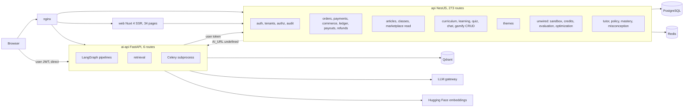
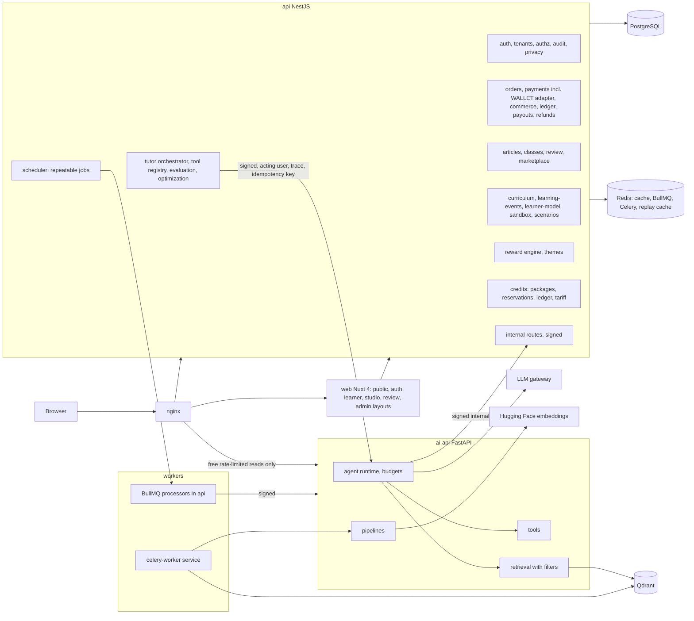

# Target Architecture

> **Status**: `planned` · **Owner**: `architect` · **Last reviewed**: `2026-10-02`
>
> The verified current architecture, the target architecture that adds modules inside the existing services only, a regenerated service responsibility matrix, the internal contract list, and explicit capacity assumptions.

Facts: [`01-verification-delta.md`](./01-verification-delta.md) (VD). Fixed constraints from `AGENTS.md`: no new microservice, one Nuxt app, `ai-api` has no `DATABASE_URL`, `api` has no LLM or Qdrant client, one root `.env`.

---

## 1. Purpose

Show where each capability of the loop lives, which service owns each row of data, and what is added to which service; replace the matrix in `../architecture/service-responsibility-matrix.md`, which still lists a Stripe webhook, a `Payout` table, `Product*` tables, a `CreatorProfile` and an `AIAgentProduct` that do not exist (K-03).

---

## 2. Current architecture (verified)



Defects drawn: nginx strips the `/api/` and `/ai/` prefixes the services expect (VD HC-14, not drawn as an edge); the browser reaches `ai-api` directly with the user JWT (VD S-13); `api` cannot call `ai-api` from its queue processors because `AI_URL` is defined nowhere (VF-16); Celery runs as a subprocess of `ai-api` (S-20); four groups of services exist without a module (VF-04).

---

## 3. Target architecture



Differences from the current state: credit-spending calls go browser, `api`, `ai-api` (D-13); `ai-api` calls `api` only through signed `/internal` routes with `x-acting-user-id`; Celery is its own compose service in dev and prod; BullMQ repeatable jobs provide the scheduler; the signed-request replay cache lives in Redis; no new service appears.

---

## 4. Service responsibility matrix (regenerated)

Legend: `own` owns and mutates, `R` read through the owner, `-` not involved. Source of truth is the store named; "state" is the verified status from VD.

| Capability | api | ai-api | Worker | Web | Source of truth | State |
|---|---|---|---|---|---|---|
| Identity, sessions, roles | own | - | - | UI | Postgres `User`, `Session` | implemented |
| Tenants, memberships, settings | own | - | - | UI | `Tenant`, `TenantMembership`, `TenantSettings` | implemented, settings unused |
| Authorization and audit | own | - | - | - | decorators, `AuditLog` | implemented, matrix stale |
| Curriculum and prerequisite graph | own | R | - | UI | `Topic` to `Step`, `SubTopicPrerequisite` | implemented, service unwired |
| Quiz scoring | own | - | - | UI | `QuizAttempt`, `Answer` | scaffolded (client-writable) |
| Learning events | own | write via `/internal` | - | - | `LearningEvent` | scaffolded |
| Learner model, misconceptions, preferences | own | R via `/internal` | - | UI | `TopicMasteryRecord`, `Misconception`, `LearningPreference` | scaffolded |
| Memory rows and write policy | own | proposes | index job | UI | Postgres memory tables | scaffolded |
| Memory vectors | - | own | CW | - | Qdrant `reducera-memory` | partial |
| RAG corpus metadata and status machine | own | - | - | UI | `Resource` | partial (no quarantine) |
| RAG vectors and retrieval | - | own | CW | - | Qdrant `reducera-embedding` | partial (filters missing) |
| LLM calls | - | own | CW | - | provider | implemented |
| Agent runtime and tools | registry, validation | own | - | UI | `ToolRegistry`, `AgentSpec` | planned |
| Tutor orchestration (reserve, run, settle) | own | run | - | UI | `DecisionTrace`, `Episode` | partial template |
| Accounting sandbox engine and ledger | own | - | - | UI | `Sandbox*` tables | partial (no routes) |
| Marketplace articles and classes | own | R (ranking) | - | UI | `Article`, `ClassProduct`, versions | implemented (API) |
| Review and moderation | own | - | - | UI | content status, `ReviewItem` (planned) | partial (`ADMIN` only) |
| Orders and payments | own | - | - | UI | `Order`, `PaymentIntent`, `PaymentTransaction`, `ManualPaymentSubmission` | implemented |
| Payment provider webhook | own (`501`) | - | - | - | provider | reserved |
| Entitlements | own | - | - | UI | `Entitlement` | implemented |
| Creator earnings, wallet, ledger | own | - | scheduler | UI | `CreatorEarning`, `Wallet`, `LedgerTransaction` | implemented |
| Payouts | own | - | - | UI | `PayoutRequest` | implemented (API) |
| Refunds | own | - | - | UI | `Refund` | implemented (API) |
| AI credits | own | - | scheduler | UI | `AICreditWallet`, ledger, reservation (planned) | scaffolded |
| Reward engine, streaks, leaderboards | own | - | - | UI | `GamificationLedger` (planned), `StreakHistory`, `LeaderboardScore` | dormant |
| Themes | own | proposer (planned) | - | UI | `Theme` | implemented lifecycle |
| Domain events | own | - | outbox worker (planned) | - | `DomainEvent` | implemented (synchronous) |
| Observability | emits | emits | emits | - | Prometheus registry now, OpenTelemetry planned | partial |
| Agent products | own | run | - | UI | `AIAgentProduct` (planned) | planned |
| Scheduler | own | - | BullMQ repeatable | - | Redis | planned |

Rules that stay: `api` is the only service that touches PostgreSQL and the only place authorization lives; `ai-api` and the Celery worker own Qdrant, the LLM client and Tavily; anything missing on the owner is added as an endpoint on the owner.

---

## 5. Module map in `api`

| Module | Today | Change | Stage |
|---|---|---|---|
| `sandbox` | service only | Module, `SandboxEntryLine` engine, routes, scenario authoring | 1 |
| `learning-events` | none | Ingest route, internal ingest, consumers (mastery, rewards) | 1 |
| `learner-model` | backfill only | Corrected `MasteryService`, writers, routes `/me/*` | 1 |
| `quiz` | client-writable scores | Register `QuizEvaluationService`, strict DTOs | 1 |
| `curriculum` | writes open to any `TEACHER` | Ownership checks; register `PrerequisiteService` | 1 |
| `review` | none | `ReviewItem`, queue, decisions, capability check | 2 |
| `articles`, `classes` | implemented | `If-Match`, provenance, rubric fields | 2 |
| `marketplace` | recommendations route | Listing filters, creators route | 2 |
| `payouts`, `refunds`, `ledger`, `commerce` | implemented | Scheduler jobs, settings destination, `WALLET` adapter | 3 |
| `credits` | unwired service | New tables, routes, internal reserve, settle, release | 4 |
| `tutor` | template | Orchestrator for the run flow | 4 |
| `agents` | none | Registry, specs, runs, incidents | 4 and 7 |
| `gamify` | CRUD | Reward engine, ledger, projections | 4 |
| `evaluation`, `optimization` | unwired | Benchmark, judge, gate | 6 |
| `privacy` | none | Export, deletion, consent | 1 |
| `internal` | 2 routes | Contract in §6 | 0 to 4 |

---

## 6. Internal contract (`/internal`, signed)

All routes carry `x-service-id`, `x-service-timestamp`, `x-service-signature`, `x-trace-id`, `x-idempotency-key` (non-GET) and `x-acting-user-id`; `api` re-authorizes the acting user on every call.

| Route | Purpose | Idempotency |
|---|---|---|
| `GET /internal/learners/:id/context` | Mastery, misconceptions, preferences, policy hints | n/a |
| `GET /internal/rag/published-resources` | Resource list for indexing with status and scope | n/a |
| `POST /internal/learning-events` | Event ingest from `ai-api` | `x-idempotency-key` |
| `POST /internal/episodes`, `/internal/decision-traces` | Trace persistence | key per run |
| `POST /internal/memories/candidates` | Memory proposals to the write policy | key per candidate |
| `POST /internal/tools/validate` | Tool call validation | key per call |
| `POST /internal/credits/reservations`, `/:id/settle`, `/:id/release` | Credit lifecycle (callable by `api` itself; `ai-api` does not call it) | key per reservation |
| `GET/POST /internal/resources/*` | Exists | exists |

---

## 7. Capacity assumptions

Every value is an assumption used to find scaling triggers; none is a measurement.

| Parameter | Symbol | Illustration [ASSUMPTION] |
|---|---|---|
| Registered learners | `N` | 1,000,000 |
| Active share in 28 days | `r` | 0.2 |
| Qualifying events per active learner per day | `e` | 15 |
| Peak to average factor | `f` | 10 |
| Tutor calls per active learner per day | `c` | 6 |

Derived load: average events per second `N * r * e / 86400` (about 35), peak `* f` (about 350); rows per year `N * r * e * 365` (about 1.1 billion); tutor calls per second at peak `N * r * c * f / 86400` (about 140).

| Trigger | Action |
|---|---|
| `LearningEvent` rows above `R_part` | Partition by month, keep 13 months online, archive older |
| Approval transaction p95 above `L_appr` | Move non-critical consumers to an outbox worker |
| API CPU or Postgres connections above `U_db` | Add API replicas (replay cache already in Redis), read replica for analytics routes |
| Qdrant memory or p95 above `M_q` | Separate collections per tenant group; replicas before shards |
| LLM gateway error rate above `E_llm` | Second provider behind the same gateway interface (D-21 budget applies) |
| Celery queue wait above `W_c` | Scale `celery-worker` replicas |

At the team size assumed (`[TEAM_CAPACITY]`, `decision-register.md`) only the first two triggers are plausible before the first pilot; the rest are recorded so they are not forgotten.

---

## 8. Algorithms

Credit reservation (stage 4), one database transaction per step:

```text
reserve(userId, amount, key):
  lock AICreditWallet row for userId
  if existing reservation with key: return it
  if balance - reserved < amount: raise INSUFFICIENT_AI_CREDITS
  insert AICreditReservation(HELD, amount, key)
  update wallet: reserved = reserved + amount

settle(reservationId, actual):
  lock wallet and reservation
  if reservation not HELD: return stored result
  spend = min(held, actual)
  insert ledger SPEND(spend)
  update wallet: balance = balance - spend, reserved = reserved - held
  set reservation SETTLED(spend)

release(reservationId):
  lock wallet and reservation
  if reservation not HELD: return
  update wallet: reserved = reserved - held
  set reservation RELEASED
```

Scheduler jobs (BullMQ repeatable, idempotent): `payment-expire-sweep`, `earning-release`, `credit-reservation-timeout`, `credit-expire`, `stage-evaluate`, `ledger-reconcile`, `reward-projection-check`.

---

## 9. Trade-offs

| Choice | Alternative | Why |
|---|---|---|
| Modules inside `api` | Split a commerce or learning service | One database, one deploy, one authorization place; the team size does not support more services |
| BullMQ repeatable jobs | A cron container or `@nestjs/schedule` | BullMQ and Redis already run; repeatable jobs survive restarts and give retries |
| Free reads only on the public `/ai/` route | All AI calls through `api` | Reads cost little and gain nothing from a hop; spending calls need reserve and settle |
| Synchronous consumers kept for money events | Outbox now | A paid order with missing access is worse than a heavier transaction (ADR-008); revisit at the trigger |

## 10. Migration notes

Order: stage 0 fixes (auth on `ai-api`, `AI_URL`, subprocess removal, route registration); then additive migrations per `13-data-model-delta.md`; then new modules behind routes guarded by the access-decision test; `AGENTS.md` rule 5 is amended by the owner after ADR-007 is accepted (not edited by this plan). The matrix in `../architecture/service-responsibility-matrix.md` is superseded by §4 once this file is accepted.
