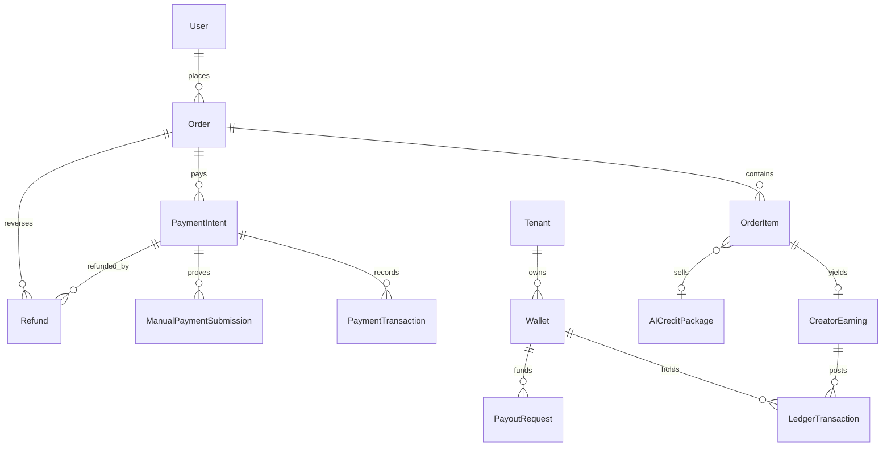
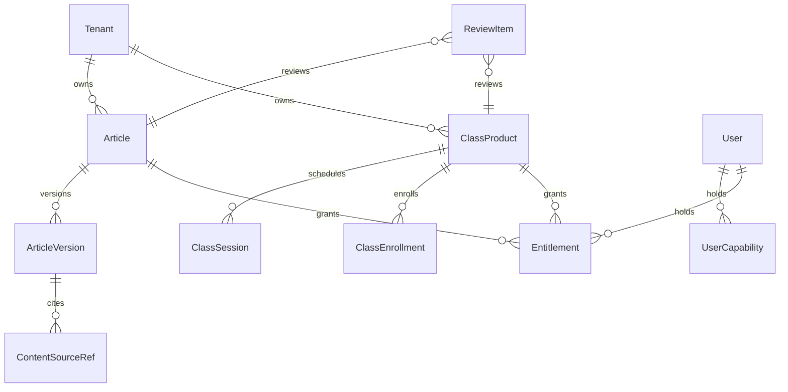
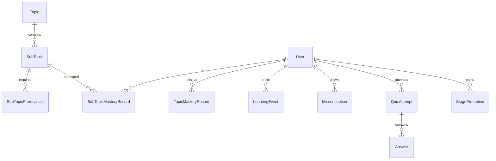
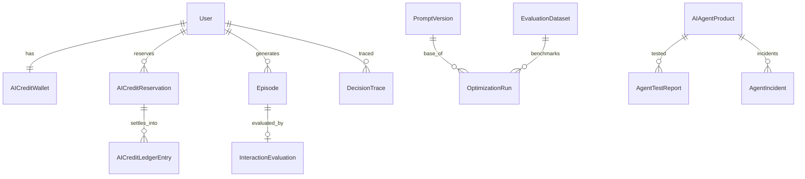
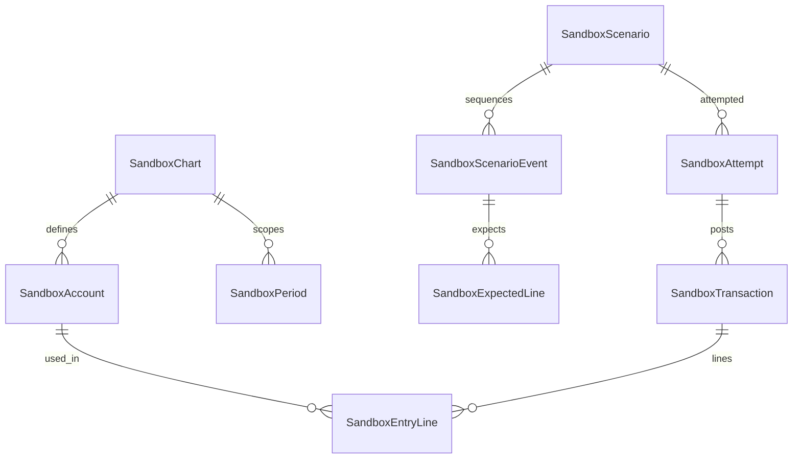
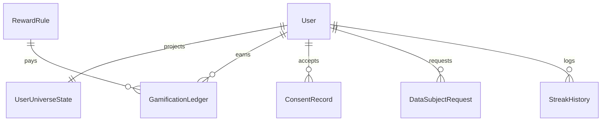

# Data Model Delta

> **Status**: `planned` · **Owner**: `data-architect` · **Last reviewed**: `2026-10-02`
>
> The smallest additive schema change set that supports the plan, mapped onto existing tables first, with new tables only where nothing fits, the remaining money-model fixes as ordered migrations, one ER diagram per bounded context, and an invariant table that says where each rule is enforced.

Facts: [`01-verification-delta.md`](./01-verification-delta.md) (VD): 88 models, 48 enums, 17 migrations. Rules from `AGENTS.md` and `CLAUDE.md` kept: never run `prisma format`; never edit an applied migration; write migrations by hand from `prisma migrate diff --from-config-datasource --to-schema prisma/schema.prisma --script`; test only on a scratch database, never the dev database `reducera`; PostgreSQL enum values cannot be dropped and a new value cannot be used in the transaction that adds it, so each enum addition is its own migration file. No code or schema is changed by this document.

---

## 1. Mapping of brief entities to existing tables

| Brief entity | Existing tables | Decision |
|---|---|---|
| User | `User` | Reuse; add `timezone` (streak day boundary) and, only under D-02, `ageBand` |
| StudentProfile | `User`, `LearningStyleProfile`, `LearningPreference`, `LearnerGoal` | Reuse. `LearningPreference` has one row per user with four free strings and no writer; preferences with confidence and evidence live in `SemanticLearnerMemory` (`traitKey`, `confidence`, `evidenceCount`), so `LearningPreference` is deprecated |
| CreatorProfile | `TeacherApplication`, `Tenant` (`slug`, `description`, `logo`), `TenantSettings` | Reuse; `Tenant.slug` is the public handle. Create `TenantSettings` on provisioning (never created today); add `evidenceJson` and `masterySnapshot` to `TeacherApplication` |
| LearningPath | `UserTopic`, `UserStep`, progress tables, `SubTopicPrerequisite` | Reuse; the path is derived from the graph plus mastery |
| Skill, KnowledgeNode | `SubTopic`, `SubTopicPrerequisite` | Reuse |
| Mastery | `TopicMasteryRecord` (keyed by `Topic`), `StepMasteryRecord` | Gap: graph nodes are sub-topics but mastery is per topic. Add `SubTopicMasteryRecord`; keep `TopicMasteryRecord` as the roll-up |
| Lesson, Quiz | `Lesson`, `Step`, `Quiz`, `Question`, `QuizAttempt`, `Answer` | Reuse; scoring becomes server side |
| Course | `Topic` today | D-16: `Topic` stays curriculum; paid courses are `ClassProduct` and `Article`; no new table until data shows demand |
| Article | `Article`, `ArticleVersion` | Reuse (`publishedVersionId` FK exists); add `ContentSourceRef` for provenance |
| Simulation | `Sandbox*` tables | Reuse and extend (`06-accounting-domain.md` §2) |
| Achievement | `Achievement`, `UserAchievement` | Reuse through reward rules |
| XPTransaction | none | Add `GamificationLedger` |
| Wallet | `Wallet` (unique `(ownerId, tenantId, currency)`) | Reuse (fixed) |
| Order, Payment | `Order`, `OrderItem`, `PaymentIntent`, `PaymentTransaction` | Reuse; `OrderItem` gains a credit package column |
| CreatorRevenue | `CreatorEarning`, `LedgerTransaction` | Reuse; maturation already exists (`releasedAt`) |
| AIConversation | `Chat`, `ChatMessage`, `Episode`, `DecisionTrace` | Reuse; `Episode` and `DecisionTrace` already carry tokens and cost |
| LearnerMemory | `EpisodicMemory`, `SemanticLearnerMemory`, `ProceduralMemory` | Reuse; add the write policy in code |
| Evaluation | `InteractionEvaluation`, `EvaluationDataset` (`isFrozen`), `PromptVersion`, `PolicyVersion`, `OptimizationRun` | Reuse; add a trigger that makes a frozen dataset immutable |
| AI credit wallet and ledger | `AICreditWallet`, `AICreditLedgerEntry` (append-only trigger), `AICreditPackage` | Reuse; add `AICreditReservation` |
| Review | none; status fields on `Article`, `ClassProduct` | Add `ReviewItem`, `UserCapability` |
| Stages | none | Add `StagePromotion`; rule parameters in `PolicyVersion` with `name = 'stage-rules'` |
| Agent product | none | Add `AIAgentProduct`, `ToolRegistry`, `AgentTestReport`, `AgentIncident` (stage 4 and 7) |
| Consent, data requests | none | Add `ConsentRecord`, `DataSubjectRequest`, `GuardianConsent` (conditional) |

---

## 2. New tables

Common rules: ids are UUID strings; money is `Decimal`, credits are integers; every new owned row has `userId` or `tenantId`; foreign keys use `RESTRICT` for financial data and `CASCADE` for personal learning data; no table is queried by `ai-api` directly.

### 2.1 `SubTopicMasteryRecord` (stage 1)

```prisma
model SubTopicMasteryRecord {
  id             String    @id @default(uuid())
  userId         String
  subTopicId     String
  score          Float     @default(0)
  confidence     Float     @default(0)
  evidenceCount  Int       @default(0)
  lastObservedAt DateTime?
  updatedAt      DateTime  @updatedAt

  @@unique([userId, subTopicId])
  @@index([subTopicId, score])
}
```

| Item | Value |
|---|---|
| Constraints | CHECK `score` and `confidence` between 0 and 1; `evidenceCount` at least 0; foreign keys to `User` (`CASCADE`) and `SubTopic` (`CASCADE`) |
| Writer, readers | `MasteryService` consumer of `LearningEvent`; readers: skill tree, adaptive policy, stage evaluator, creator analytics (aggregate) |
| Retention | Life of the account |

### 2.2 `AICreditReservation` and credit purchase (stage 4)

```prisma
enum CreditReservationStatus {
  HELD
  SETTLED
  RELEASED
  EXPIRED
}

model AICreditReservation {
  id             String                  @id @default(uuid())
  userId         String
  amount         Int
  status         CreditReservationStatus @default(HELD)
  settledAmount  Int?
  idempotencyKey String
  sourceType     String
  sourceId       String?
  expiresAt      DateTime
  createdAt      DateTime                @default(now())
  resolvedAt     DateTime?

  @@unique([userId, idempotencyKey])
  @@index([status, expiresAt])
}
```

| Item | Value |
|---|---|
| Constraints | CHECK `amount > 0`; CHECK `settledAmount` between 0 and `amount` when `SETTLED`; CHECK `resolvedAt` set exactly when status is not `HELD`; trigger: a row leaves `HELD` once and never changes afterwards |
| Related changes | `AICreditLedgerEntry.reservationId` nullable, foreign key `RESTRICT`; `OrderItem.creditPackageId` nullable, foreign key to `AICreditPackage`; the CHECK `OrderItem_exactly_one_product` is dropped and re-added as `num_nonnulls(articleId, classId, topicId, creditPackageId) = 1` (one migration, applies to an empty set of credit rows) |
| Invariant | `AICreditWallet.reserved` equals the sum of `HELD` amounts of the user; the existing wallet CHECK (`reserved <= balance`) stays |
| Writer, readers | `CreditsService` (reserve, settle, release, expire job); readers: `GET /credits/me`, G-6 guardrail |
| Retention | Reservations 13 months; ledger kept (append-only) |

### 2.3 Reward tables (stage 4)

```prisma
enum RewardKind {
  XP
  STAR
  CREDIT
}

model RewardRule {
  id         String     @id @default(uuid())
  code       String
  version    Int
  eventType  String
  rewardKind RewardKind
  amount     Int
  dailyCap   Int?
  active     Boolean    @default(true)
  createdAt  DateTime   @default(now())

  @@unique([code, version])
}

model GamificationLedger {
  id             String     @id @default(uuid())
  userId         String
  kind           RewardKind
  delta          Int
  ruleId         String?
  eventId        String?
  reversalOfId   String?    @unique
  idempotencyKey String     @unique
  createdAt      DateTime   @default(now())

  @@index([userId, createdAt])
}

model UserUniverseState {
  userId        String   @id
  xp            Int      @default(0)
  stars         Int      @default(0)
  level         Int      @default(1)
  currentStreak Int      @default(0)
  longestStreak Int      @default(0)
  freezes       Int      @default(0)
  updatedAt     DateTime @updatedAt
}
```

| Item | Value |
|---|---|
| Constraints | `GamificationLedger` append-only (`forbid_row_mutation`); CHECK `delta <> 0`; `UserUniverseState` counters at least 0 |
| Invariant | `xp` equals the sum of `XP` deltas; `stars` the sum of `STAR` deltas; verified by test GM-07 and a scheduled check |
| Writer, readers | Reward engine only; readers: `/gamification/me`, leaderboards |
| Notes | `User.totalPoints`, `stars`, `currentStreak`, `longestStreak` stay as projections until cutover; `StreakActivity` already contains `LOGIN`, `DAILY_LOGIN`, `REGISTER`, which the engine never uses, and gains `SCENARIO` in its own migration |

### 2.4 Review and capability (stage 2)

```prisma
enum ReviewSubjectType {
  ARTICLE
  CLASS
  SCENARIO
  AGENT
}

enum ReviewStatus {
  PENDING
  CLAIMED
  APPROVED
  REJECTED
  CHANGES_REQUESTED
}

enum Capability {
  REVIEWER
}

model ReviewItem {
  id            String            @id @default(uuid())
  subjectType   ReviewSubjectType
  subjectId     String
  versionId     String?
  submittedById String
  claimedById   String?
  status        ReviewStatus      @default(PENDING)
  rubricJson    Json?
  note          String?           @db.Text
  decidedAt     DateTime?
  createdAt     DateTime          @default(now())

  @@unique([subjectType, subjectId, versionId])
  @@index([status, createdAt])
}

model UserCapability {
  id          String     @id @default(uuid())
  userId      String
  capability  Capability
  grantedById String
  grantedAt   DateTime   @default(now())
  revokedAt   DateTime?

  @@index([userId, capability])
}
```

| Item | Value |
|---|---|
| Constraints | CHECK `claimedById IS NULL OR claimedById <> submittedById` (no self review); partial unique index on `UserCapability(userId, capability)` where `revokedAt IS NULL`; `ReviewItem` rows are never deleted |
| Writer, readers | Review service; `ADMIN` grants capability (audited); readers: review queue, product page status |
| Retention | Kept with the product history |

### 2.5 Stages (stage 5)

```prisma
enum LearnerStage {
  LEARNER
  PRACTITIONER
  CREATOR
  MENTOR
  KNOWLEDGE_ENTREPRENEUR
}

model StagePromotion {
  id              String       @id @default(uuid())
  userId          String
  stage           LearnerStage
  inputsJson      Json
  policyVersionId String?
  decidedBy       String?
  createdAt       DateTime     @default(now())

  @@unique([userId, stage])
}
```

Append-only; the stage evaluator writes `PRACTITIONER`; `CREATOR` rows are written by the application approval (BP-04) and `MENTOR` after a human grant.

### 2.6 Sandbox additions (stage 1)

New: `SandboxChart`, `SandboxEntryLine`, `SandboxScenarioEvent`, `SandboxExpectedLine`, enums `SandboxAccountType`, `SandboxPeriodStatus`, `SandboxTxKind`, `SandboxTxStatus`, `SandboxMode`, `ScenarioStandardProfile`. Column additions to existing tables are listed in `06-accounting-domain.md` §2.

```prisma
model SandboxChart {
  id              String                  @id @default(uuid())
  name            String
  standardProfile ScenarioStandardProfile @default(GENERAL)
  ownerId         String?
  createdAt       DateTime                @default(now())
}

model SandboxEntryLine {
  id            String           @id @default(uuid())
  transactionId String
  accountId     String
  direction     LedgerDirection
  amount        Decimal          @db.Decimal(20, 4)
  sequence      Int

  @@index([transactionId])
  @@index([accountId])
}

model SandboxScenarioEvent {
  id         String   @id @default(uuid())
  scenarioId String
  sequence   Int
  periodLabel String
  eventDate  DateTime @db.Date
  narrative  String   @db.Text

  @@unique([scenarioId, sequence])
}

model SandboxExpectedLine {
  id        String          @id @default(uuid())
  eventId   String
  accountId String
  direction LedgerDirection
  amount    Decimal         @db.Decimal(20, 4)
  sequence  Int

  @@unique([eventId, sequence])
}
```

| Item | Value |
|---|---|
| Constraints | CHECK `amount > 0`; deferred constraint trigger on `SandboxTransaction`: sum of debit lines equals sum of credit lines at commit when status is `POSTED`; trigger blocks updates and deletes of posted transactions and their lines; unique `reversesId`; no foreign key from any sandbox table to a commerce table (schema test) |
| Writer, readers | `AccountingEngine`; readers: grading, trial balance, statements |
| Retention | Attempts kept 24 months [ASSUMPTION], scenarios kept |

### 2.7 Provenance, resource trust, learning events (stages 1, 4, 5)

```prisma
enum ContentSourceType {
  LESSON
  ARTICLE_VERSION
  RESOURCE
  SCENARIO
}

model ContentSourceRef {
  id               String            @id @default(uuid())
  articleVersionId String
  sourceType       ContentSourceType
  sourceId         String
  note             String?

  @@unique([articleVersionId, sourceType, sourceId])
  @@index([sourceType, sourceId])
}
```

| Table | Change | Backfill |
|---|---|---|
| `Resource` | add `ownerId`, `tenantId`, `trustStatus` (`UPLOADED`, `QUARANTINED`, `REVIEWED`, `PUBLISHED`), `scanFlags Json?`, `reviewedById`, `reviewedAt` | existing embedded rows become `PUBLISHED` with `scanFlags = {"legacy": true}` so retrieval keeps working; `ownerId` stays null for them and is reported |
| `LearningEvent` | add `source` enum `SERVER`, `CLIENT`, `AI_SERVICE` (default `SERVER`); CHECK that `CLIENT` events carry only telemetry types, enforced in code and by an allow-list table | none (no rows) |
| `Misconception` | add enum values `CONFIRMED`, `RESOLVING` (separate migration); add `lastIncidentEventId` | none (no rows) |
| `EvaluationDataset` | trigger: rows with `isFrozen = true` cannot be updated or deleted | none |
| `TeacherApplication` | add `evidenceJson Json?`, `masterySnapshot Json?` | none |
| `User` | add `timezone String @default("Asia/Jakarta")` and, only under D-02, `ageBand` | default |
| `TenantSettings` | create one row per tenant at provisioning; backfill rows for existing tenants | one row per tenant |

### 2.8 Agent tables (stages 4 and 7)

`ToolRegistry` as specified in `../architecture/agent-safety.md` §3.1 (admin-managed, `deprecatedAt`); `AIAgentProduct` as in `../architecture/ai-agent-marketplace.md` §2 with one change: a single status enum with `VALIDATING` (K-07) and `ownerId` as a foreign key to `User` (`RESTRICT`); `AgentTestReport(agentId, version, reportJson, passed, createdAt)` append-only; `AgentIncident(agentId, userId, incidentType, toolId, severity, traceId, createdAt)` append-only. Course products and agent products stay in separate tables.

### 2.9 Privacy tables (stage 1)

| Table | Fields | Constraints |
|---|---|---|
| `ConsentRecord` | `userId`, `document`, `version`, `acceptedAt` | unique `(userId, document, version)`; append-only |
| `DataSubjectRequest` | `userId`, `type` (`EXPORT`, `DELETE`), `status`, `requestedAt`, `completedAt` | one open request per user and type (partial unique index) |
| `GuardianConsent` (only if D-02 applies) | `minorUserId`, `guardianContactHash`, `status`, `grantedAt`, `scope` | unique per minor; append-only history |

### 2.10 Outbox (stage 3)

`ConsumerDelivery(eventId, consumer, status, attempts, lastError, nextAttemptAt)` with unique `(eventId, consumer)`; used for non-critical consumers when the trigger `L_appr` is reached. Money and entitlement consumers stay inside the publisher transaction.

---

## 3. Remaining money-model fixes as migrations

The defects in VD §3.1 that are closed need no migration. The open ones follow the order add, backfill, dual-read, drop.

| Step | Migration | Content | Precondition | Rollback |
|---|---|---|---|---|
| M-01 | `credit_reservation_and_package_item` | 2.2 changes | scratch database; `AICreditPackage` has no rows depending on it | roll forward with a corrective migration |
| M-02 | `tenant_settings_backfill` | One `TenantSettings` row per existing tenant | none | delete inserted rows by marker |
| M-03 | `subtopic_mastery` | 2.1 | none | drop table |
| M-04 | `enum_additions_a` | `Misconception` values, `StreakActivity.SCENARIO` | none | values stay; unused |
| M-05 | `resource_trust` | 2.7 `Resource` columns and backfill | list rows with null owner | columns nullable, backfill reversible |
| M-06 | `sandbox_v2` | 2.6 | sandbox tables empty | drop new tables |
| M-07 | `review_and_capability` | 2.4 | none | drop tables |
| M-08 | `reward_ledger` | 2.3 | none | drop tables |
| M-09 | `privacy_tables` | 2.9 | legal review of document names | drop tables |
| M-10 | `order_legacy_columns_drop` | Drop `Order.amount`, `snapToken`, `gateway` | no read or write in code for one release (grep and `trace_path`) | restore from backup only; the data is deprecated |
| M-11 | `topic_product_retire` | Stop selling `Topic`: remove the topic branch from `order-catalog.service.ts`; later drop `Order.topicId`, `OrderItem.topicId` after a dual-read period | zero new topic orders for a defined window (D-16) | re-enable the branch |
| M-12 | `earning_status_cleanup` | Remove use of `EarningStatus.PAID_OUT` in code (enum value stays) | none | none |
| M-13 | `outbox` | 2.10 | trigger `L_appr` reached | drop table |
| M-14 | `agent_tables` | 2.8 | stage 4 exit | drop tables |
| M-15 | `prerequisite_acyclic` | Constraint trigger on `SubTopicPrerequisite` that rejects an insert when the new `subTopicId` is reachable from `requiresId` (recursive query) | the seeded graph is a chain, so no row violates it | drop trigger |

---

## 4. ER diagrams

### 4.1 Commerce and money



### 4.2 Content, review, entitlement



### 4.3 Learning and mastery



### 4.4 AI and credits



### 4.5 Sandbox



### 4.6 Gamification and privacy



---

## 5. Invariants

| ID | Invariant | Enforced by |
|---|---|---|
| I-01 | Debits equal credits per posted sandbox entry | database (deferred trigger) and application |
| I-02 | Posted sandbox rows are immutable | database (trigger) |
| I-03 | `AICreditWallet.reserved` equals the sum of `HELD` reservations | application in one transaction; reconcile job |
| I-04 | `balance >= 0` and `reserved <= balance` | database (CHECK, exists) |
| I-05 | A reservation leaves `HELD` once | database (trigger) |
| I-06 | Credit and gamification ledgers are append-only | database (trigger) |
| I-07 | One order item references exactly one product | database (CHECK, extended) |
| I-08 | No self review | database (CHECK) and application |
| I-09 | One active reviewer grant per user | database (partial unique) |
| I-10 | A frozen evaluation dataset cannot change | database (trigger) |
| I-11 | `UserUniverseState` equals the ledger sums | application; test GM-07 |
| I-12 | `CLIENT` learning events never earn mastery or rewards | application (allow-list) |
| I-13 | Sandbox rows never reference commerce rows | schema test |
| I-14 | Existing money invariants (one live payment per order, one capture, wallet non-negative, append-only ledger) | database (exist) |
| I-15 | The prerequisite graph is acyclic | database (trigger, M-15) and application |

## 6. Trade-offs

| Choice | Alternative | Why |
|---|---|---|
| `SubTopicMasteryRecord` beside `TopicMasteryRecord` | One generic `MasteryRecord(nodeType, nodeId)` | Real foreign keys and simple unique keys; the roll-up stays cheap to read |
| Reservation table | Reservation as a ledger row | The ledger is append-only (VD VF-01); a reservation changes state |
| `UserCapability` for reviewers | New `Role` value | Enum values cannot be dropped; capabilities can be revoked and audited |
| Rules as rows | Constants | A tuning change must not rewrite history |

## 7. Migration notes

Apply on a scratch database first: `migrate deploy` from empty, `migrate diff` empty, then a copy of a populated database (`CREATE DATABASE ... TEMPLATE`), as the V1 plan did for the theme migration. The dev database has no `_prisma_migrations` table and needs the baseline in `../architecture/PHASE_1_REPORT.md` §5 before any of this runs there (G-T-14).
