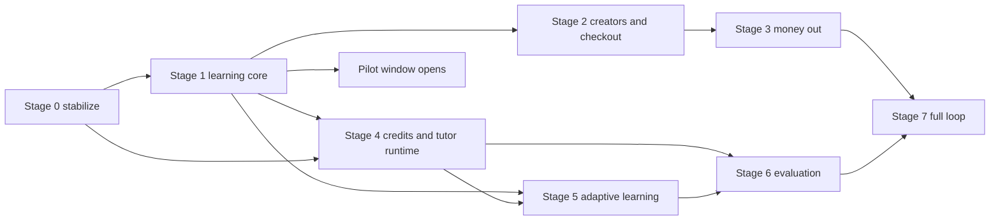

# Canonical Roadmap

> **Status**: `planned` · **Owner**: `owner` · **Last reviewed**: `2026-10-02`
>
> One sequence of eight stages that replaces `phased-roadmap.md` (13 phases), `TARGET_STATE.md` §5 and the V1 execution tracks, sized for one part-time developer, with a testable exit gate per stage and an explicit list of what to cut.

Facts: [`01-verification-delta.md`](./01-verification-delta.md) (VD). Gaps: [`09-gap-analysis.md`](./09-gap-analysis.md). Decisions: [`decision-register.md`](./decision-register.md) (DR).

---

## 1. Objective

Reach a first public pilot on university accounting with a graded sandbox, reviewed creator content, safe money flows and a metered AI tutor, in an order where every stage ends in a demonstration that passes automated checks and where the riskiest defects (VD HC-14, VF-07, VF-20) are fixed first.

## 2. Scope

Stages 0 to 7 below. Out of scope until their preconditions exist: a payment gateway (D-14), an institution channel, a second vertical, DSPy and any optimizer (D-10), the agent marketplace (D-09), quests and worlds (`08-gamification-and-theme.md` §4).

## 3. Design

### 3.1 Capacity assumptions

| Parameter | Value | Tag |
|---|---|---|
| Team | One developer, part-time, about 15 hours per week, plus an AI coding agent executing small verified tasks (`[TEAM_CAPACITY]`) | [ASSUMPTION: `decision-register.md`] |
| Work unit | One verified task of at most about 400 changed lines with its verify step (V1 plan §2 size rule) | [DOC-ONLY: V1 plan §2] |
| Throughput `v` | 4 work units per week | [ASSUMPTION: 3 to 4 hours per unit including verification] |
| Work unit counts | Estimated by listing deliverables per stage and weighting each by 1 to 3 units | [ASSUMPTION: no velocity data] |
| Launch date | None; durations are in weeks of this capacity (`[LAUNCH_TARGET_DATE]`) | [ASSUMPTION] |

### 3.2 Dependencies

The pilot window opens after stage 1 with platform-authored content, free classes by invited creators (through the existing admin override routes) and the sandbox; KPI collection starts there. Stage 3 is gated by D-20 and does not open payouts before it passes.

### 3.3 V1 execution tracks, verified status

| Track | Status (VD §7) | Where it lands |
|---|---|---|
| R repository and operations | PARTIAL (R-03 BLOCKED, R-04 evidence missing) | Stage 0 |
| TD database | PARTIAL (verify steps not run) | Stage 0 (CI job with a scratch database) |
| TT theme layer | PARTIAL (TT-06) | Stage 0 |
| S SSR and speed | PARTIAL (S-02, S-05, S-06) | Stage 0 |
| TU UI | PARTIAL (TU-04 to TU-09) | Stage 0 |
| B brand and copy | PARTIAL (B-01 to B-03) | Stage 0 |
| TG generator | PARTIAL (TG-02 to TG-04) | TG-04 in stage 5; TG-03 deferred |
| A accounting and learning | PARTIAL | Stages 1, 2, 4 |
| Q quality gates and docs | NOT STARTED | Stage 0 (Q-02, Q-03, Q-04); Q-01 and Q-06 deferred |

---

## 4. Step-by-step

Work units (WU) are estimates; weeks are WU divided by `v` = 4.

### Stage 0: stabilize and make reachable

| Item | Content |
|---|---|
| Scope | Fix nginx prefix stripping (G-T-16); move web calls to the shared helper and real routes (G-U-07); validate the caller on every `ai-api` route, remove tokens from query strings, Celery arguments and BullMQ data, define `AI_URL` (G-A-03, G-A-04); gate curriculum reads (G-T-02); align hold and refund defaults and document env keys (G-B-02, G-T-11); restrict `/metrics` (D-17); CI job that runs the nine integration suites on a scratch database (G-T-03); remove the Celery subprocess and add the compose service (G-T-09); register or delete the seven unwired services (G-T-05); finish TU-04, TU-05, TT-06, S-05, S-06, B-02, B-03; repair doc links and regenerate the authorization matrix (G-T-13); run R-03 and R-04 |
| Dependencies | `INTERNAL_AI_API_SECRET`, `MANUAL_PAYMENT_ACCOUNTS` set by the owner; scratch Postgres |
| Decisions | D-05, D-13 (for the `ai-api` fixes), D-17 |
| KPIs start | Build and health: compose healthy, integration suites green, Playwright matrix pass rate |
| Demo | `docker compose up`; `curl http://localhost/api/v1/docs` returns Swagger; open `/`, `/marketplace`, an order pay page; an unauthenticated call to each `ai-api` route returns 401 |
| Exit gate | `docker compose ps` all healthy; `curl http://localhost/nginx-health`, `/api/v1/docs` answer 200; `pnpm jest` with `TEST_DATABASE_URL` shows 0 skipped integration suites and 0 failures; `ST-15` passes; Playwright matrix passes on `/`, `/login`, `/marketplace`, `/learn/orders/[id]/pay` with zero console errors; every V1 track is `DONE` or `BLOCKED` with a reason |
| Covers | prerequisite to every v1 brief phase |
| Size | about 30 WU, 8 weeks |

### Stage 1: learning core closes

| Item | Content |
|---|---|
| Scope | `LearningEvent` v2 and ingest; server-side quiz scoring (`QuizEvaluationService` registered, strict DTOs, removal list of client-writable `PATCH` routes); corrected `MasteryService` with magnitude golden vectors; `SubTopicMasteryRecord`; sandbox module, routes, engine fixes (VF-03), `SandboxEntryLine`, platform scenarios; curriculum ownership (S-18); correct prerequisite cycle check with a database trigger (VF-21); onboarding, diagnostic, skill tree, dashboard; consent records, data export and deletion routes; level variant for the theme |
| Dependencies | Stage 0; D-01, D-08, D-15, D-18 |
| Decisions | D-01, D-08, D-15, D-18, D-02 if D-01 is B or C |
| KPIs start | KPI-H1, KPI-S2, diagnostic completion, scenario completion |
| Demo | Register, take the diagnostic, land on the first node, open scenario 1, post a balanced entry, see the trial balance and a misconception hint; a forged `PATCH` of a quiz score is refused |
| Exit gate | First session to first balanced entry passes as a Playwright E2E; `AU-01`, `AU-02`, `AU-04` pass; engine invariants E-1 to E-9 have tests including the compound-entry case; no route accepts client-written score or progress (strict-DTO spec) |
| Covers | v1 Phase 1 (learning core), part |
| Size | about 38 WU, 9 to 10 weeks |

### Stage 2: creator supply and checkout

| Item | Content |
|---|---|
| Scope | Reviewer capability and review queue (`ReviewItem`, `UserCapability`); studio UI for articles and classes with `If-Match`; become-creator UI with evidence; marketplace unified list and creator profile; admin UI for payments, applications, moderation; retire `Topic` as a product path (D-16); role-aware middleware and layouts; `/streams/*` SSE aliases |
| Dependencies | Stage 1 (sandbox scenario for procedural articles); D-04, D-12, D-16 |
| Decisions | D-04, D-12, D-16 |
| KPIs start | KPI-M1, KPI-M4, G-3 refund rate, G-4 rejection rate |
| Demo | A creator drafts and submits an article; a reviewer approves; a learner buys with manual transfer; the admin approves the proof; the learner reads the article; the audit drawer lists each step |
| Exit gate | The six steps pass as a Playwright E2E; each step has an `AuditLog` row; `REVIEW_CONFLICT_OF_INTEREST` test passes; `payment-flow.int.spec.ts` green on a scratch database |
| Covers | v1 Phase 2 (creator economy), part |
| Size | about 44 WU, 11 weeks |

### Stage 3: money out

| Item | Content |
|---|---|
| Scope | BullMQ repeatable jobs (`earning-release`, `payment-expire-sweep`, `ledger-reconcile`); hold at least the refund window; `TenantSettings` payout destination; studio earnings and payouts UI; admin finance and refund UI; `WALLET` payment adapter; reconciliation report; drop `Order.amount`, `snapToken`, `gateway`; second admin account and separation of duties; backup and restore drill for Postgres and Qdrant; `Idempotency-Key` interceptor on money routes |
| Dependencies | Stage 2; D-05, D-07, D-20 |
| Decisions | D-05, D-07, D-20 |
| KPIs start | Earning-to-wallet latency, payout review time, reconciliation breaks per period |
| Demo | A sale releases to the wallet after the hold; the creator requests a payout; admin B approves and marks paid with evidence; a refund inside the window reverses the earning |
| Exit gate | Ledger sums equal wallet balances after a randomized replay; refunds reverse earnings and entitlements; double-approval tests pass with two concurrent requests; `payouts.int.spec.ts`, `refunds.int.spec.ts` green; a restore drill brings back a Postgres dump and a Qdrant snapshot |
| Covers | v1 Phase 2 (creator economy), remainder |
| Size | about 24 WU, 6 weeks |

### Stage 4: AI credits and tutor runtime

| Item | Content |
|---|---|
| Scope | Credit packages as order items, `AICreditReservation`, tariff, `CreditsService`; internal contract (`/internal/*`), Redis replay cache; agent runtime and tool registry in `ai-api`, budgets; episodes and decision traces from results; RAG filters, quarantine, fences, chunk-id citations; tutor sessions routes and UI with cost confirm; proxy credit-spending calls through `api`; reward engine and ledger; OpenTelemetry in both services |
| Dependencies | Stages 0 and 1; D-06, D-13, D-21 |
| Decisions | D-06, D-13, D-21 |
| KPIs start | KPI-A1 to A4, G-5, G-6, tutor cost per answer |
| Demo | A learner sees the cost, sends a question, receives a cited answer, the balance falls by the settled amount; the same request twice charges once; an injected instruction in a document does not change tool use |
| Exit gate | Concurrent reserves never make the balance negative; `ST-01` to `ST-16` pass; `AU-08`, `AU-12`, `AU-13` pass; reward tests `GM-01` to `GM-07` pass |
| Covers | v1 Phase 1 (learning core), remainder |
| Size | about 48 WU, 12 weeks |

### Stage 5: adaptive learning

| Item | Content |
|---|---|
| Scope | Next-activity decision with rationale; misconception lifecycle states; memory write policy, export and delete; Path and Assessment agents; stage evaluator and `StagePromotion`; creator scenario authoring with `validateScenario` (D-18); theme preference and admin theme page (TG-04); pilot measurement protocol (D-19) |
| Dependencies | Stages 1 and 4 |
| Decisions | D-18, D-19, D-11 |
| KPIs start | KPI-S3 (G-1), KPI-C1, preference evidence counts |
| Demo | A weak node triggers an intervention after its prerequisites pass; a poisoned memory attempt is dropped; the pilot dashboard shows effect size with its interval |
| Exit gate | Learning gain measured on a pilot cohort with the protocol of D-19; `AU-05`, `AU-06`, `AU-14`, `AU-16` pass; `ST-11`, `ST-12` pass |
| Covers | v1 Phase 3 (advanced AI), part |
| Size | about 28 WU, 7 weeks |

### Stage 6: evaluation and controlled improvement

| Item | Content |
|---|---|
| Scope | Frozen benchmark of at least 50 scenarios (`isFrozen` trigger); judge calibrated against human labels; acceptance gate with component metrics; canary and rollback; admin optimization screen |
| Dependencies | Stages 4 and 5; D-10 |
| Decisions | D-10 |
| KPIs start | Judge agreement, benchmark pass rate by component |
| Demo | One candidate prompt is evaluated, shown with component deltas, then approved or rejected by an admin; a regression triggers rollback in the canary |
| Exit gate | One candidate evaluated then decided by a human; agreement between judge and human labels reported with its interval; `AU-09` passes |
| Covers | v1 Phase 3 (advanced AI), remainder |
| Size | about 24 WU, 6 weeks |

### Stage 7: full circular economy

| Item | Content |
|---|---|
| Scope | Agent tables, sandbox runtime for agents, agent review, agent marketplace pages; verified badges and portfolio (D-03); reinvestment by wallet payment beyond credits; remix and provenance views |
| Dependencies | Stages 3 and 6; D-09, D-03 |
| Decisions | D-09, D-03 |
| KPIs start | KPI-C3, KPI-C4, KPI-L4 |
| Demo | A creator builds an agent, passes the sandbox benchmark, a reviewer approves, a learner runs it with credits, the creator earns through the order pipeline |
| Exit gate | First agent published through every gate (sandbox, evaluation, safety tests, human approval); `AU-07`, `AU-13` pass for agents |
| Covers | v1 Phase 4 (full loop) |
| Size | about 30 WU, 7 to 8 weeks |

### Totals

| Milestone | Work units | Weeks at `v` = 4 |
|---|---|---|
| Stage 0 | 30 | 8 |
| Pilot-ready (stages 0 and 1) | 68 | 17 |
| Creator marketplace live (through stage 2) | 112 | 28 |
| Money out ready (through stage 3) | 136 | 34 |
| Credits and tutor runtime (through stage 4) | 184 | 46 |
| Through stage 7 | 266 | about 66 |

---

## 5. What to cut or defer at this capacity

| Cut or defer | Reason |
|---|---|
| Agent marketplace, optimizer, DSPy (stages 6 and 7) | Preconditions need stage 4 and 5 data and a reviewer team; no learner value before the pilot |
| Payment gateway (D-14), institution licence, second vertical | Volume and demand evidence missing |
| Quests, worlds, universe tables | The loop does not need them |
| Leaderboards beyond cohort boards | Privacy and farming cost for little learning value |
| Career agent, free-text AI judge, scenario authoring by creators until stage 5 | Each needs the review and evaluation base |
| Q-01 theme documents and Q-06 benchmark re-run | Documentation and cost work with no loop effect; do when the model changes |
| Credit packages if the budget is tight | Ship the tutor with a free allowance `F` set from `B_llm` first; add packages after the pilot shows usage |

Sequence under pressure: stage 0, stage 1, then the minimum of stage 2 (reviewer capability, studio article editor, admin payment UI) with invited creators; start the pilot; do stage 3 before any real payout; stage 4 before opening the tutor beyond the free allowance.

## 6. Acceptance criteria

| Criterion | Test |
|---|---|
| Each stage has a demo script and an automated exit gate | Table review; each gate names tests that exist or are created in that stage |
| Dependencies are acyclic | §3.2 |
| No stage schedules a deferred item before its preconditions | §5 and DR D-09, D-10 |

## 7. Risks

| Risk | Severity | Mitigation |
|---|---|---|
| Throughput assumption `v` is wrong | M | Re-estimate after stage 0 from measured work units per week |
| Secrets and gateway access block stage 0 (R-03) | H | Owner supplies values; mark `BLOCKED` otherwise and continue with items that need none |
| One part-time developer is a single point of failure | H | Small verified tasks, plans and evidence kept in the repository |
| Decisions arrive late | M | Defaults in DR; ADR written when accepted |
| Stage 4 grows (runtime, credits, RAG trust, rewards, OTel) | M | Split into 4a credits and tutor, 4b rewards and OTel if exit gate slips |

## 8. Rollback

Every stage is additive: new tables, new routes behind the access-decision test, feature flags for UI entry points. Migrations are not edited; a bad migration is corrected by a new one. Code reverts by the owner's commits (this plan stages and commits nothing). A bad scheduled job is disabled by removing its repeatable registration; a bad reward rule is deactivated by a new version row.
